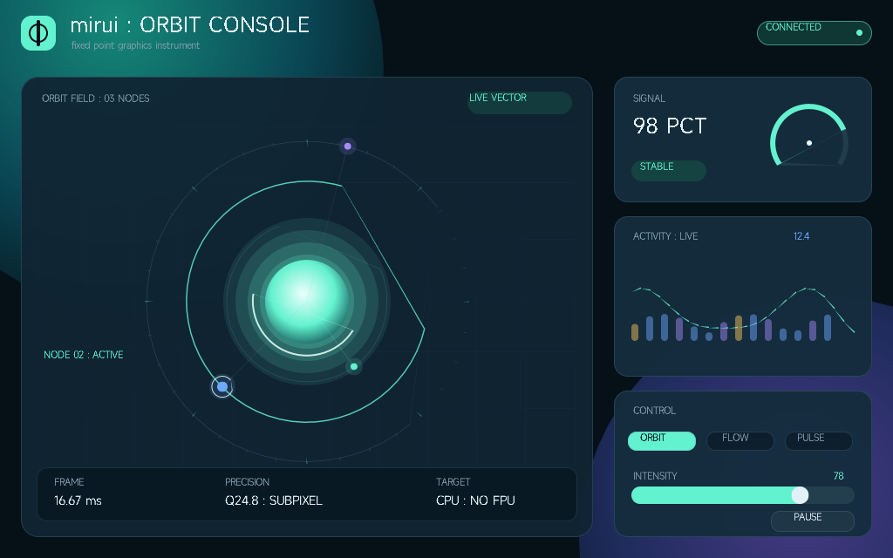

# mirui

[](https://crates.io/crates/mirui)
[](https://docs.rs/mirui)
[](LICENSE)

A `no_std`, ECS-driven UI framework for embedded, desktop, and
WebAssembly. Renders with 24.8 fixed-point subpixel precision on a
software rasterizer designed for MCUs without an FPU; optionally runs
on top of SDL2 (CPU or hardware-accelerated) on desktop.



[Open the interactive gallery](https://mirui.rs/) or run `cargo run -p gallery --example orbit_console_demo` locally.

## Features

- **ECS architecture** — entities, components, systems, resources, queries; system scheduler with named priority slots
- **`no_std` + `alloc`** — runs on bare-metal MCUs (ESP32-C3, STM32) with a global allocator
- **Subpixel rasterizer** — 24.8 fixed-point throughout (layout, rendering, hit-test, events). Scanline coverage AA on any `Path`; SDF / 2×2 supersample fast paths for quad fills
- **Vector drawing** — `Canvas` exposes `fill_path` / `stroke_path` / `draw_line` / `draw_arc`; `DrawCommand::FillPath` puts path fills inside the same View pipeline as built-in widgets
- **Typography** — shaped text supports bounded layout, fallback fonts, bidirectional scripts, path placement, oriented carets, selection geometry, and path-aware hit testing
- **Layout** — Flexbox, absolute positioning, padding, justify / align; `Dimension::{Px, Percent, Auto, Content}`
- **Animation** — Tween, Spring (WWDC23-derived critical damping), retargetable; declarative `animate!` and `timer!` macros
- **Theme** — `ColorToken` / `ThemedColor`; built-in dark / light + custom tokens; per-`WidgetState` (Hovered / Pressed / Error / Disabled) overlay routing
- **Interaction states** — hover, press, error, disabled propagated through ECS markers; system-level dispatch
- **Multi-touch** — pinch / rotate gesture recognition from raw pointer streams; `SimAction` for scripted multi-touch in tests
- **Input feedback** — opt-in `InputFeedbackPlugin` paints a cursor dot and a magnetic-membrane water drop responding to rotary / wheel / click input
- **Dirty-flag partial refresh** — only re-renders changed regions; per-entity `Dirty` + `PrevRect` machinery
- **HiDPI** — automatic scale factor propagation
- **Plugins** — bundle clock, perf, input feedback into objects `App` drives through five lifecycle hooks
- **Pluggable backends** — SDL2 CPU, SDL2 GPU (hardware-accelerated), `FramebufSurface` (embedded RGB565 / ARGB8888 / RGB888 / RGB565Swapped), `compose_backend!` for routing primitives across multiple backends
- **Declarative DSL** — `ui!` macro for nested widget trees with attributes, enchants, walk loops, conditionals

## Quick Start

```toml
[dependencies]
mirui = { version = "0.43", features = ["sdl"] }
```

```rust
use mirui::prelude::*;
use mirui::surface::sdl::SdlSurface;
use mirui::ui::UiScope;

fn main() {
    let backend = SdlSurface::new("hello mirui", 480, 320);
    let mut app = App::new(backend);
    app.with_default_widgets().with_default_systems();

    // Root fills the viewport with a Surface bg + Column layout by
    // default; chain .bg_color()/.layout() before .id() to override.
    let root = app.spawn_root().id();

    let mut cx = UiScope::new(&mut app.world, root);
    build_root(&mut cx);
    drop(cx);

    app.run();
}

#[compose]
fn build_root() {
    ui! {
        column (direction: FlexDirection::Column, grow: 1.0) {
            header (
                bg_color: ColorToken::Primary,
                text_color: ColorToken::OnPrimary,
                height: 40,
                text: "Hello mirui!",
                border_radius: 8
            ) {}
            content (bg_color: ColorToken::SurfaceVariant, grow: 1.0) {}
            footer (height: 30, text: "ECS + DSL") {}
        }
    };
}
```

`mirui::prelude` brings `App`, layout types, `Color` / `Dimension` /
`Fixed`, `Entity` / `World`, `WidgetBuilder`, theme tokens, and the
`ui!` / `compose` macros. Surface backends, plugins, and individual
widget kinds stay on their canonical paths so the prelude doesn't
pin a platform or feature choice.

`#[compose]` slips a `cx: &mut UiScope` first parameter into the
function; every `ui!` invocation inside the body reads that `cx` to
spawn widgets, so the four-line `:( parent world :)` header from
earlier releases is no longer needed. Compose helper functions with
`ui!(helper_fn(args))` — the macro threads `cx` through for you.

### Other targets

The snippet above runs on the SDL backend (desktop). mirui also runs
bare-metal on RISC-V and ARM Cortex-M MCUs through `FramebufSurface`,
and a Cargo workspace template ships UI code that builds on both
desktop and embedded targets unchanged. See
[`docs/quickstart.md`](docs/quickstart.md) for the full walkthrough,
including ESP32-C3 wiring, the workspace layout, and a recipe for
adding new target crates.

[`docs/typography.md`](docs/typography.md) covers text paths, static and mutable geometry, reactive path selection, signal-derived curves, and handler-driven edits.

## MIRX assets

`gen-mirx image` converts common images through ICU and writes RAW, native pixel, RLE, LZ4, reversible frequency, or quantized frequency IMAGE storage. The generated bytes are reopened and preflighted with the same checked profiles consumed by `mirx::Reader` and mirui's texture loader. `--stride-align` applies only to stored RAW rows. Output geometry, input/output/workspace placement, workspace alignment, cache actions, and current host-slice address alignment use the same `DecodeRequest` vocabulary as FRAMES and `MirxTextureOptions`.

```shell
cargo xtask gen-mirx image --in logo.png --out logo.mirx --format rgba8888 --coding frequency-quantized --quality 75 --input-memory flash --output-align 64 --stride-multiple 64 --output-memory shared-noncoherent --workspace-align 64 --workspace-memory shared-coherent
```

`gen-mirx frames` accepts an ordered list of decoded source images, evaluates whole-frame, sparse-tile, previous-frame, RLE, native pixel, LZ4, reversible frequency, and optional quantized frequency candidates, then writes one checked FRAMES container. The output writer preserves declared source alignment at the final file address; decoded GPU/DMA geometry, memory placement, workspace alignment, and cache boundaries remain a runtime `DecodeRequest` choice.

```shell
cargo xtask gen-mirx frames --in frame-000.png --in frame-001.png --out animation.mirx --format rgba8888 --tile 32x32 --input-align 64 --input-memory flash --output-align 64 --stride-multiple 64 --output-memory shared-noncoherent --workspace-align 64 --workspace-memory shared-coherent
```

The frame generator prints the selected storage and coding for every frame, source-to-container ratio, loss policy, recovery bound, runtime path, stored input alignment and current host-slice address result, input/output/workspace placement, required cache actions, exact aligned canvas/workspace/backup sizes, required group slots, and every decoded plane's offset, stride, and allocation extent.

`Texture::from_mirx` keeps compatible RAW pixels borrowed and decodes compressed pixels into managed CPU storage. `Texture::plan_mirx` exposes exact group-slot, output, alignment, and reusable workspace requirements for fixed caller buffers. `MirxTextureOptions` carries `PayloadLimits` plus `DecodeRequest`, including execution intent, input/output/workspace placement, cache synchronization, and independent GPU/DMA width, stride, plane, base-address, and workspace constraints. Non-CPU output or workspace placement requires the explicit caller-buffer plan instead of the managed loader.

`MirxFontProvider::from_mirx_with_storage` reconstructs every encoded glyph surface once into a caller-owned static arena. `MirxFontStorage` separates persistent surface slots and decoded bytes from temporary group slots and codec workspace, so construction leaves no hidden per-glyph allocation and later glyph lookups return stable borrowed rasters. `SurfaceRequirements` applies the same address, plane, allocation extent, and stride constraints used by IMAGE and FRAMES; RAW glyph surfaces continue to borrow their original MIRX bytes.

```rust
use mirui::render::texture::{MirxTextureOptions, Texture};
use mirx::types::ByteAlignment;

let options = MirxTextureOptions::new()
    .with_base_alignment(ByteAlignment::new(64).unwrap())
    .with_plane_alignment(ByteAlignment::new(64).unwrap())
    .with_stride_multiple(64);
let texture = Texture::from_mirx_with(
    include_bytes!("logo.mirx"),
    options,
)?;
```

`MirxFramesPlan::open` validates the primary FRAMES timeline under the same `DecodeRequest` and reports encoded-address checks plus exact group-slot, aligned canvas, codec workspace, and restore-previous backup requirements. `bind(MirxFramesStorage { .. })` attaches named caller-owned buffers once; `MirxFramesSession::present` reuses them and returns a borrowed `Texture` for each requested frame. The plan and session expose required input invalidation and output cleaning at the platform cache boundary. `frame_at_ticks` and `present_at` resolve variable durations and finite or unbounded play counts directly from absolute sequence ticks without an allocated timing table.

`cargo run -p gallery --example mirx_frames_snapshot -- /tmp/mirx-frames.ppm` builds a compressed three-frame asset, plans flash input plus 64-byte shared output/workspace storage, reports the required non-coherent output cache action and actual host input alignment, selects frames by timeline tick, and writes a contact sheet while reusing one playback canvas.

## DSL Syntax

```rust
ui! {
    :(
        parent: root
        world: &mut world
    :)

    // Widget with attributes
    container (direction: FlexDirection::Column, grow: 1.0) {
        header (text: "Header", height: 40) {}
        body (grow: 1.0) {}
    }

    // Enchants — attach extra ECS components to the spawned entity
    img (width: 16, height: 16, image: Image::new(&IMG_THUMBS_UP)) [
        PhysicsBody { x: Fixed::ZERO, y: Fixed::ZERO },
        Velocity { vx: Fixed::from_int(1), vy: Fixed::ZERO },
    ] {}

    // Iteration
    walk items.iter() with item {
        row (text: item.name, bg_color: item.color) {}
    }

    // Conditional
    if show_footer {
        footer (text: "visible") {}
    }
}
```

Powered by [xrune](https://github.com/W-Mai/xrune). Integer literals
in attributes (`height: 40`) coerce to `Fixed` / `Dimension` via `Into`.

### Common attributes

| Attribute | Type | Description |
|-----------|------|-------------|
| `bg_color` / `text_color` / `border_color` | `Color` or `ColorToken` | Solid colour or theme token |
| `text` | `&str` | Text content |
| `border_radius` / `border_width` | `Fixed` | Subpixel-accurate |
| `width` / `height` | `Dimension` | `Px / Percent / Auto / Content` |
| `grow` | `f32` | Flex grow factor |
| `direction` | `FlexDirection` | Row / Column |
| `justify` / `align` | `JustifyContent` / `AlignItems` | Axis alignment |
| `padding` | `Padding` | Inner padding |
| `position` | `Position` | Flex / Absolute |
| `left` / `top` | `Dimension` | Absolute position |
| `image` | `Image` | Image component |

## Theme

Built-in widgets read colours through `ColorToken`s; switch palette
with `app.with_theme(Theme::light())`, swap at runtime with
`app.set_theme(...)`.

```rust
use mirui::ui::theme::{Theme, ColorToken};

let mut theme = Theme::dark();
theme.set(ColorToken::Custom("brand_accent"), Color::rgb(255, 105, 180));
app.with_theme(theme);
```

`WidgetState` (`Hovered` / `Pressed` / `Error` / `Disabled`) routes
overlays automatically: hover blends 8% `OnSurface`, press 12%, error
16% `Error`, disabled blends text/icon to 38% on `Surface` and
container roles to 12%. No widget needs to author per-state logic.

## Animation

```rust
use mirui::anim::{Spring, SpringConfig};

let mut spring = Spring::new(
    SpringConfig::new(220, 0.3),  // 220 ms perceptual duration, 30% bounce
    Fixed::ZERO,
);
spring.target(Fixed::from_int(100));
// driven each frame by the animation system
```

`#[mirui::animate!(...)]` and `mirui::core::timer!(...)` macros declare
motion components that the framework's animation / timer systems
tick automatically.

## Plugins

Plugins package cross-cutting behaviour. Each plugin's docstring lists
what it inserts so reading `add_plugin(...)` is enough to know what
changes in `World`.

| Plugin | Inserts |
|--------|---------|
| `StdInstantClockPlugin` | resource: `MonoClock` (std-only) |
| `PerfReportPlugin` | resource: `PerfAccum`; hook: `post_render` |
| `FpsSummaryPlugin` | hook: `post_render` |
| `InputFeedbackPlugin` | resources: `InputFeedback`, `InputFeedbackInput`; systems: cursor + rotary feedback; views: cursor (pri 90), rotary (pri 91); entities: `OverlayCursor` (lazy), `OverlayRotary` (eager); hooks: `on_event`, `pre_render` |

Custom plugin:

```rust
use mirui::prelude::*;
use mirui::app::plugin::Plugin;

/// MyHotkeysPlugin — Esc quits.
///
/// **Inserts**
/// - resource: none
/// - system:   none
/// - view:     none
/// - entity:   none
/// - hooks:    on_event
struct MyHotkeysPlugin;

impl<B, F> Plugin<B, F> for MyHotkeysPlugin
where B: mirui::surface::Surface, F: mirui::app::RendererFactory<B>
{
    fn build(&mut self, _app: &mut App<B, F>) {}
    fn on_event(&mut self, _world: &mut World, event: &mirui::input::event::input::InputEvent) -> bool {
        matches!(event, mirui::input::event::input::InputEvent::Key {
            code: mirui::input::event::input::KEY_ESCAPE, pressed: true,
        })
    }
}

app.add_plugin(MyHotkeysPlugin);
```

## ScrollView

```rust
use mirui::input::event::scroll::{ScrollAxis, ScrollConfig, ScrollOffset};

ui! {
    :(
        parent: root
        world: &mut world
    :)

    scroll_container (direction: FlexDirection::Column, grow: 1.0) [
        ScrollOffset { x: Fixed::ZERO, y: Fixed::ZERO },
        ScrollConfig {
            direction: ScrollAxis::Vertical,
            elastic: true,
            content_height: Fixed::from_int(800),
            content_width: Fixed::ZERO,
        }
    ] {
        walk items.iter() with item {
            row (height: 60, bg_color: item.color, text: item.label) {}
        }
    }
};
```

Drag scrolling, inertia (spring-damped), elastic bounce, iOS-style
scroll chaining across nested scroll views, and per-axis content
clamping.

## Hybrid Backends — `compose_backend!`

Route different draw primitives to different backends, no runtime
dispatch:

```rust
use mirui_macros::compose_backend;

compose_backend! {
    pub struct Hybrid {
        sw: SwRenderer,
        gpu: MyGpuBackend,
    }
    route {
        default => sw,
        blit => gpu,
        clear => gpu,
    }
}
```

Generated `Hybrid<__B0, __B1>` is generic over each backend's lifetime
parameters. See `gallery/examples/compose_backend_demo.rs` and
`compose_backend_dsl.rs`.

## ECS

```rust
// Spawn
let e = world.spawn();
world.insert(e, MyComponent { ... });

// Query
let mut buf = Vec::new();
world.query::<PhysicsBody>().and::<Velocity>().collect_into(&mut buf);

// Resources
world.insert_resource(GameSeed(42));
let seed = world.resource::<GameSeed>().unwrap().0;

// Systems
#[mirui::system(order = SystemSlot::Animation)]
fn physics_system(world: &mut World) { /* ... */ }

app.add_system(physics_system::system());
```

`SystemSlot` enum names the standard scheduling positions
(`SimInput / DeltaTime / InteractionState / Animation / Timer /
ScrollInertia / LazyList / TabPages / Normal`). Lower values run
earlier; user systems default to `Normal`.

## Performance

ESP32-C3 (RV32 160 MHz, no FPU) + ST7735S 128×128 SPI:

| Demo | frame avg | FPS | Notes |
|------|-----------|-----|-------|
| Three-body (widgets + dirty rect) | ~13 ms | ~77 | Default `quad-aa` off; partial refresh |
| Cover-flow (3D quad transforms) | ~52 ms | ~19 | `default-features = false` |

`App::run` writes a per-stage `FrameTimings` resource each frame
(input / systems / layout / render / flush / seed_prev) and pushes
`frame_nanos` into a 256-sample `FrameStats` ring for jitter / p99
analysis. `FpsSummaryPlugin` averages and prints the breakdown,
`BudgetReportPlugin` warns when avg or p99 cross a configured
threshold.

### Drilling into spans

Wrap any code with `mirui::trace_span!("name")` or annotate a fn
with `#[mirui::trace_fn("name")]`. With a clock plugin installed
(`StdInstantClockPlugin` on desktop, a custom one calling
`mirui::core::perf::set_clock` on bare metal), every invocation records
into a ring buffer that `mirui::core::perf::drain_events()` returns.

`mirui::core::perf::format_chrome_event` writes one event as Chrome
trace JSON for [Perfetto](https://ui.perfetto.dev). On `std`
`PerfReportPlugin::with_perfetto_writer` dumps the stream to a
file. On ESP, the bundled `mirui-examples/examples/esp32c3-animation`
demo prints `[trace] {...}` lines through `esp_println`; the
host-side `tools/esp-trace.py` script collects them into a
Perfetto-loadable JSON file.

## Hardware Examples

[mirui-examples](https://github.com/W-Mai/mirui-examples) hosts the
ESP32-C3 demos:

- `demo-threebody` (default) — three gravitating bodies
- `demo-particles` — pulse rings, bouncing bars, particles
- `demo-subpixel` — bars moving by 1 px vs 0.1 px (subpixel AA)
- `demo-shapes` — clock face via `draw_line` / `draw_arc`
- `demo-butterfly` — flapping vector butterfly
- `demo-coverflow` — cover flow with 3D quad transforms
- `demo-flipcard`, `demo-gesture`, `demo-widgets` — additional showcases
- `demo-hidpi-downscale` / `demo-hidpi-upscale` — HiDPI mode toggles

Flash with `cargo run --release --features demo-XXX --no-default-features`.

## License

MIT
