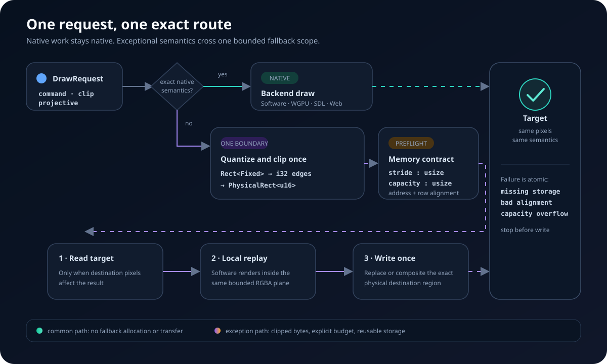

# Exact backend fallback

MIRUI classifies every checked draw before it changes the target. A backend
uses its native path only when that path preserves the complete request:
geometry, paint, clipping, compositing, filtering, and projection. Everything
else either enters an exact bounded fallback or returns a typed error.



## Route contract

`RenderRoute::Native` performs no fallback allocation, readback, or upload.
`RenderRoute::ExactFallback(FallbackRegion)` carries the physical destination
and row stride required by a prepared software replay. Planning completes
before target access, so missing storage, invalid alignment, and insufficient
capacity cannot leave a partially updated scope.

The fallback path has three transfers at most:

1. Read the clipped target region when the operation depends on existing
   destination pixels.
2. Replay the unsupported scope into the same region-local RGBA plane.
3. Write or composite that region back once.

Opaque isolated content can skip the first step when its blend semantics do
not depend on the destination. Consecutive operations that share ordering and
clip state stay inside one fallback scope instead of crossing the backend
boundary per command.

## Geometry and memory types

The types describe different boundaries and intentionally compose rather than
alias one another:

```text
Rect<Fixed>                     logical geometry with subpixels
└─ Viewport::physical_rect()
   └─ PhysicalRect<u16>         clipped integer destination pixels
      └─ FallbackRegion         destination pixels + RGBA row stride
         └─ PlaneLayout         local format, stride, size, alignment
            └─ AlignedPlane     validated caller-owned bytes
```

`PhysicalRect` is shared by surfaces, dirty flushes, target readback, mirror
copies, scrolling, and fallback routes. `FallbackRegion` remains separate
because only a fallback route promises a row layout and byte budget. Embedding
the full `PlaneLayout` in every retained route would repeat format, required
size, and alignment fields; scene replay can retain many routes on a small
target.

Numeric conversion follows one direction:

| Value | Type | Lifetime |
|---|---|---|
| layout, glyph, path, clip, affine transform | `Fixed` | until raster or viewport conversion |
| homography and projection intermediates | `Fixed64` | until projection validation |
| unclipped pixel edges and signed motion | `i32` | before target clipping |
| clipped physical origin and extent | `u16` in `PhysicalRect` | after clipping |
| stride, capacity, required bytes, slice offsets | `usize` | runtime memory only |
| MIRX dimensions, offsets, and stride | `u32` | stable wire representation |
| SDL/WGPU/Web coordinates | backend-required `u32` or `f64` | final host call only |

Logical bounds are scaled in `Fixed`; top and left are floored, bottom and
right are ceiled; signed edges are clipped to the target; conversion to `u16`
happens last. Backends consume the resulting `PhysicalRect` and do not round it
again.

## Aligned caller storage

`PlaneRequirements` declares start-address and row-stride alignment. The
packed CPU default uses alignment 1. DMA, firmware, or GPU upload paths can
request aligned storage explicitly:

```rust
use mirui::render::{PlaneRequirements, ProjectiveFallback};

let requirements = PlaneRequirements::new(64, 64)?;
let fallback = ProjectiveFallback::borrowed_with(&mut bytes, requirements)?;
```

Planning rounds the minimum RGBA row size up to the requested stride alignment.
Binding checks the actual slice address, aligned stride, checked
`stride_bytes * height`, and available capacity. The same validated stride is
used for readback, software replay, and upload. The ordinary native route does
not inspect or carry this storage.

## Backend behavior

- Software writes directly into its framebuffer and normally needs no RGBA
  fallback plane.
- WGPU keeps supported projective geometry and glyph sampling native; exact
  destination-dependent operations use a clipped target edit on desktop.
- SDL GPU reads one clipped region into the configured aligned plane, performs
  local software replay, and uploads it with the same pitch.
- Web Canvas copies packed `ImageData` rows into the configured plane, replays
  locally, compacts only at the browser API boundary, and writes one
  `ImageData` region.

The public route result is semantic rather than predictive performance data.
A native route is preferred; fallback cost is proportional to the clipped
physical region and the number of backend crossings, not to the full surface
or glyph count.
