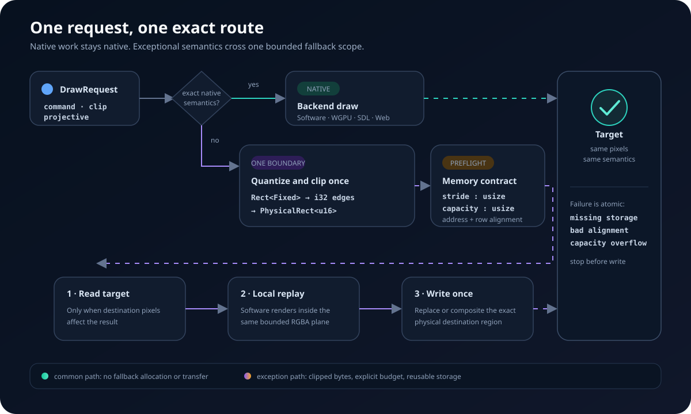

# Typography

mirui shapes text into positioned glyphs, then optionally places those glyphs on a registered vector path. The same `Path` and `PathId` types drive drawing, clipping, hit testing, and text baselines.

## Text box overflow

Assign a finite width when text should wrap or show an ellipsis. `Ellipsis` also requires a font in the stack that maps U+2026. Explicitly sized axes clip ordinary `Text` to the transformed text box for both overflow policies; `Auto` and `Content` preserve glyph ink overhang within the ancestor clip. Path text uses its placed glyph geometry and ancestor clip because its ink can extend beyond the layout box.

```rust
ui! {
    Text(
        "A long status label",
        width: Dimension::percent(100),
        paragraph: ParagraphStyle {
            wrap: TextWrap::NoWrap,
            max_lines: Some(1),
            overflow: TextOverflow::Ellipsis,
            ..ParagraphStyle::default()
        }
    )
};
```

## Layout failure reporting

`App::render()` and `App::render_dirty()` return `RenderError::TextLayout` when text preparation fails. Drawing, scrolling, and framebuffer flush are skipped for that frame. `App::last_text_layout_failure()` identifies the text entity, preparation stage, and available capacity details; a successful layout clears the diagnostic.

Low-level callers can use `render_system::try_update_layout` to receive the failure directly. The existing `update_layout` and dirty-region convenience functions retain their return types and record failures as a `TextLayoutFailure` World resource. A failed pass invalidates cached geometry for retry but does not restore text-cache entries already retired during preparation.

## Bound dynamic content

`text_capacity` reserves UTF-8 content storage for a `Text` or `Button` label. A reactive expression can format directly into a stack buffer and copy a complete value into that storage without allocating during the content update:

```rust
#[compose]
fn reading_label(reading: Signal<u16>) {
    ui! {
        Text(text: ${ format_args!("{:03}", reading.get()) }, text_capacity: 4)
    };
}
```

The capacity counts UTF-8 bytes, not characters. A value that exceeds it or fails to format leaves the previous valid content intact; the `Text` component records a `TextContentError`. If the first value fails, `App::render()` and `App::render_dirty()` return `RenderError::TextContent` before drawing or flushing. `App::last_text_content_failure()` identifies the entity and error, prioritizing labels without a valid first value. A later valid update clears that diagnostic. Runtime overflow after a valid value does not block rendering of the rest of the UI.

The bounded write covers storage and formatting performed by `Text`; an expression such as `format!(...)`, `.to_string()`, or a cloned `Signal<String>` can allocate before the write. Use `format_args!` over borrowed or scalar values when the update itself must not allocate. Text shaping, layout, font caches, and backend resources have separate capacity requirements. Bounded content is a plain-text value; use the existing localized-text path when the label must follow locale changes.

## Reserve bounded layout storage

`App::with_text_layout_capacity` prepares text-cache storage before the first layout pass. Set `TextLayoutLimits` first when the default byte budget is unsuitable. The returned error leaves the previous cache installed; calls after text layout has started return `TextLayoutError::InUse`. `App::try_with_text_layout_limits` can also change limits after reservation and before layout while preserving the declared capacity; an incompatible limit returns an error without replacing the cache. The existing fluent `with_text_layout_limits` reports that error by panicking rather than silently removing the bound.

```rust
use mirui::text::{TextLayoutCapacity, WorkspaceCapacity};

app.with_text_layout_capacity(TextLayoutCapacity {
    layout_slots: 4,
    measurements: 4,
    lines: 16,
    runs: 32,
    glyphs: 64,
    carets: 64,
    workspace: WorkspaceCapacity {
        runs: 16,
        glyphs: 32,
        scratch_glyphs: 32,
        lines: 16,
    },
})?;
```

`layout_slots` covers retained layout handles and their generation storage. The line, run, glyph, and caret capacities cover all retained paragraphs plus one paragraph's temporary output; they are aggregate counts, unlike the per-paragraph limits in `TextLayoutLimits`. `workspace` bounds private shaping buffers. The reservation checks actual retained vector capacities and the workspace against `TextLayoutLimits::cache_bytes`. Later requests above the declared capacities fail explicitly instead of growing those buffers. Other renderer and font caches have separate storage.

A reusable UI module can declare its own `module_text_capacity: TextLayoutCapacity` with `App::require_text_layout_capacity` during setup. Requirements for layout slots, measurements, lines, runs, glyphs, and carets add together; shaping-buffer requirements take the maximum because one scratch area is reused. After all modules are composed, call `App::prepare_text_layout` before the first layout pass:

```rust
app.require_text_layout_capacity(module_text_capacity)?;
// Compose the remaining modules before preparing the shared cache.
app.prepare_text_layout()?;
```

Registration does not replace the cache. Preparation checks the combined request against the active byte budget and leaves the previous cache intact on failure. Calls after layout starts and mixing additive requirements with `with_text_layout_capacity` return an error rather than discarding another module's reservation. `App::render()` and `App::render_dirty()` also prepare a pending requirement before layout; a failure returns `RenderError::TextPreparation`, with its cause available through `App::last_text_layout_preparation_error()`. Applications that control startup should call `prepare_text_layout` explicitly to report failures before entering the frame loop. Without an opt-in requirement, text layout keeps its existing on-demand behavior.

On Web Canvas, a demo can provide an untransformed, 1× per-run ink-extent hint during setup:

```rust
app.prefer_text_raster_scratch(256, 8)?;
```

`App` takes the maximum width and height across hints and prepares raster slots before each frame using the current viewport scale. It provisions retained slots from the number of constructed bounded `Text` widgets; each slot retains its RGBA buffer, offscreen canvas, image data, and pixel views. A slot belongs to one text run: unchanged content reuses its raster, while changed content redraws into the same slot without displacing another run. The slots share one software raster scratch. One generation's requested RGBA bytes are capped at 8 MiB; a separate 8 MiB preflight includes the requested RGBA and slot metadata for both the retained generation and its replacement during resize. The glyph cache has its own independent 8 MiB nominal canvas-pixel limit; these are not a combined text-resource budget. The scratch checks bound managed Rust requests, not actual allocator capacity or browser heap usage. A resized viewport or a new bounded widget may require more storage. If preparation fails, the previous slots remain available and drawing continues through the glyph cache where needed; the error is available from `App::last_text_raster_scratch_preparation_error()`. Identical requests rejected by geometry or budget preflight are not rebuilt on every frame. Pool construction failures retry with at most 64 skipped preparation calls between attempts; a changed request or `trim_memory` clears the failure state. A memory trim releases the retained scratch and glyph/texture pools before the next preparation. Static text and runs that exceed the prepared extent keep the existing glyph-cache path; the hint is not a strict capacity or a zero-resource-growth guarantee. A bounded `Text` can produce multiple layout runs; if run identities exceed the prepared slot count, new runs replace the least recently used slot. `text_capacity` limits UTF-8 content bytes, not raster dimensions. Transformed text may also exceed the hint.

`WebCanvasRendererFactory::text_resource_stats()` distinguishes scratch preparation attempts and failures, retained-slot hits, draws, run evictions, and fallbacks from bounded runs that created a glyph-cache surface. Preparation counters count actual new-pool attempts, not cached rejections or skipped calls. `bounded_scratch_current` and `bounded_scratch_peak` are `WebScratchResourceUsage` snapshots. Their Rust capacity covers the RGBA slots and slot table; the peak includes old/new overlap and partial failed construction. Canvas and ImageData fields count retained objects and construction overlap. ImageData byte counts use its declared RGBA pixel length; canvas pixel bytes are only an RGBA-equivalent area, not measured backing allocation. The `js_pixels` view shares ImageData storage, and the retained `rust_view` refers to the Rust RGBA buffer. `bounded_scratch_upload_bytes` counts full-slot uploads after cache misses, not newly allocated bytes; `bounded_upload_bytes` counts new glyph-cache pixel uploads. Scratch and fallback counters cover native linear bounded text; path-laid-out and projective text use separate routes. These counters exclude the software raster scratch, glyph-cache metadata, browser object overhead, internal Canvas allocations, and delayed garbage collection, so they do not establish a browser-heap limit. Ordinary text and text inputs retain their existing rendering path.

An explicit memory warning retains the bounded text-layout cache and its live handles so that reservation still applies to the next frame. Web Canvas raster scratch and glyph/texture pools are separate reconstructible resources and are released. Unbounded text caches retain their existing trim behavior.

## Text on a static path

`path!` stores its commands in the program image. Registering those commands with `insert_static` keeps the path borrowed and gives it a stable `PathId`.

```rust
use mirui::prelude::*;

static ARC: Path = path!(M 16 72 Q 96 8 176 72);

fn register_arc(app: &mut App<impl Surface>) -> PathId {
    app.paths()
        .insert_static(ARC.commands())
        .expect("path capacity")
}

#[compose]
fn curved_title(arc: PathId) {
    ui! {
        Text("Status", path: arc, font_size: 24)
    };
}
```

Passing a `PathId` uses subpath `0`, starts at distance `0`, follows the path forward, and uses the full available length.

## Place multiple lines

Each paragraph line uses one consecutive subpath, beginning at `TextPath::subpath()`. The usable length of each subpath constrains wrapping, alignment, justification, and ellipsis before glyph placement.

```rust
use mirui::prelude::*;

static LINES: Path = path!(
    M 12 36 L 172 36
    M 24 68 Q 92 104 160 68
);

fn register_lines(app: &mut App<impl Surface>) -> PathId {
    app.paths()
        .insert_static(LINES.commands())
        .expect("path capacity")
}

#[compose]
fn multiline_label(lines: PathId) {
    ui! {
        Text(
            "The first line stays straight and the next follows the curve.",
            path: lines,
            paragraph: ParagraphStyle {
                wrap: TextWrap::Word,
                max_lines: Some(2),
                ..ParagraphStyle::default()
            },
        )
    };
}
```

No baseline array or copied command buffer is created. Line-only subpaths are sampled directly from `Path`; curved subpaths reuse the bounded measurement cache. A missing or invalid subpath rejects the path layout before placed glyph or caret frames are published.

## Select a range and direction

`TextPath` describes how text consumes a registered path without copying its commands.

```rust
use mirui::prelude::*;

let placement = TextPath::new(path)
    .with_subpath(1)
    .with_range(Fixed::from_int(12)..Fixed::from_int(180))
    .with_offset(Fixed::from_int(8))
    .with_direction(PathDirection::Reverse)
    .with_seam(Fixed::from_int(36));

ui! {
    Text("Reverse around the ring", path: placement)
};
```

`with_seam` chooses the distance treated as the start of a closed subpath. The selected range remains measured in path-length units after the seam is applied.

`with_offset` leaves a fixed-point leading inset inside the selected range. Wrapping, alignment, ellipsis, glyphs, and carets use the remaining path length.

The builder API accepts the same value:

```rust
let label = Text::build("Status")
    .font_size(24)
    .path(placement)
    .spawn(cx.world_mut());
```

## Switch paths reactively

The DSL accepts a `Signal<PathId>` as a reactive `path` attribute. Replacing the signal value moves the existing text entity to the new path and transfers its path-change subscription.

```rust
#[compose]
fn selectable_path(first: PathId, second: PathId) {
    let selected = Signal::new(first);
    let selection = selected.clone();

    ui! {
        Column () {
            Text("Live route", path: $selection)
            Button ("Switch", width: 80, height: 36) on Tap {
                selected.update(|path| {
                    *path = if *path == first { second } else { first };
                });
            }
        }
    };
}
```

## Derive path geometry from signals

Create one mutable path, reserve its command storage once, and bind its geometry to signals. `bind_path` installs an owner-bound effect: signal changes edit the existing path, advance its revision, and dirty every subscribed text or drawing entity.

```rust
#[compose]
fn elastic_baseline(amplitude: Signal<Fixed>) {
    let mut geometry = Path::try_with_capacity(2).expect("path storage");
    geometry
        .move_to(Point::new(0, 48))
        .quad_to(Point::new(80, 48), Point::new(160, 48));
    let path = cx.paths().insert(geometry).expect("path capacity");
    let live_amplitude = amplitude.clone();

    cx.bind_path(path, move |geometry| {
        let y = Fixed::from_int(48) - live_amplitude.get();
        geometry
            .set_command(1, mirui::render::path::PathCmd::QuadTo {
                ctrl: Point::new(80, y),
                end: Point::new(160, 48),
            })
            .expect("stable command shape");
    })
    .expect("mutable path");

    ui! {
        Text("Signal-driven curve", path: path)
    };
}
```

The effect retains the path allocation and command capacity. Prefer `set_command` when the command topology is stable; use `clear` plus path-building methods when the topology itself changes.

## Edit a path from a handler

Event handlers receive the same scoped path access API. Editing by `PathId` preserves entity identity and updates all consumers of the path.

```rust
ui! {
    Text("Tap to bend", path: path, height: 72) on Tap {
        let _ = ctx.paths().edit(path, |geometry| {
            geometry
                .set_command(1, mirui::render::path::PathCmd::QuadTo {
                    ctrl: Point::new(80, 4),
                    end: Point::new(160, 48),
                })
                .expect("stable command shape");
        });
    }
};
```

## Query caret and selection geometry

`PathTextGeometry::for_widget` resolves the text entity's computed rectangle,
scroll offsets, and accumulated 2D or projective transform. Caret hit testing
and selection ribbons therefore use the same placed geometry as rendering.

```rust
use mirui::prelude::*;

fn inspect_path_text(
    world: &World,
    label: Entity,
    pointer: Point,
    mut visit: impl FnMut([Point; 4]),
) {
    let Some(geometry) = PathTextGeometry::for_widget(world, label) else {
        return;
    };

    if let Some(hit) = geometry
        .hit_test(pointer, Fixed::from_int(6))
        .expect("valid projection")
    {
        let mut storage = [PathSelectionRibbon::default(); 16];
        let selection = hit.text_offset()..hit.text_offset().saturating_add(4);
        let ribbons = geometry
            .selection_into(selection, &mut storage)
            .expect("selection capacity");
        for ribbon in ribbons {
            visit(ribbon.quad());
        }
    }
}
```

Mixed-direction selections are split at visual-run and line boundaries. A
render-only label pays no caret-frame cost; caret frames and ribbons are
created only when queried and use caller-provided bounded storage.
`PathTextGeometry::with_transform` accepts an explicit `Transform` or
`Transform3D` for scene tools that already hold the final render transform.
Projection through or behind the near plane returns
`PathTextGeometryError::InvalidProjection`. Selection output remains unchanged
when capacity or projection validation fails.

## Backend behavior



| Geometry | Software | WGPU | SDL GPU | Web Canvas |
|---|---|---|---|---|
| Linear and affine | native | native | native run cache | native canvas path |
| Posed coverage | inverse sampled | instanced atlas | batched scalar atlas | per-glyph transform |
| Posed SDF | derivative-aware | derivative-aware | exact coverage route | exact coverage route |
| Projective glyphs | inverse sampled | projective atlas | bounded software target | bounded software target |

`render::PosedGlyphs` pairs borrowed positioned glyphs and placement frames for
render commands, Canvas calls, and scene replay. Construction rejects mismatched
slice lengths without allocating.

SDL GPU and Web Canvas use a `ProjectiveFallback` supplied through their
renderer factory for projective glyphs, fills, borders, and image blits with
rounded corners, opacity, and composite modes. Its
fixed RGBA storage is both the target and scratch space.
`ProjectiveFallback::borrowed(&mut bytes)` uses a caller-owned fixed buffer;
`ProjectiveFallback::new(bytes)` owns its buffer. Shape and image requests use
projected visual bounds to limit the required storage; glyph
requests use projected ink bounds. Preflight rejects missing or insufficient
capacity before drawing. Unsupported projective commands remain errors.
Gallery reserves 2 MiB for this target on Web Canvas and SDL GPU.
The complete routing, numeric-domain, and aligned-memory contract is described
in [Exact backend fallback](backend-fallback.md).

## Storage and invalidation

- `PathId` is a generational handle; removing a path invalidates stale handles.
- Static entries borrow command slices and reject edits.
- Mutable entries own or adopt their command storage and expose a monotonically advancing revision.
- Text entities subscribe to the path selected by their `TextPath` component.
- Baseline sampling, posed glyphs, caret frames, ink bounds, and hit testing are cached by path identity and revision.
- Path edits recompute affected line lengths and invalidate placement through the same path revision.
- Ordinary text without a `TextPath` stays on the linear shaping and rendering path.

Set the registry limit before inserting paths when the application needs a fixed budget:

```rust
app.with_path_capacity(24)?;
```
