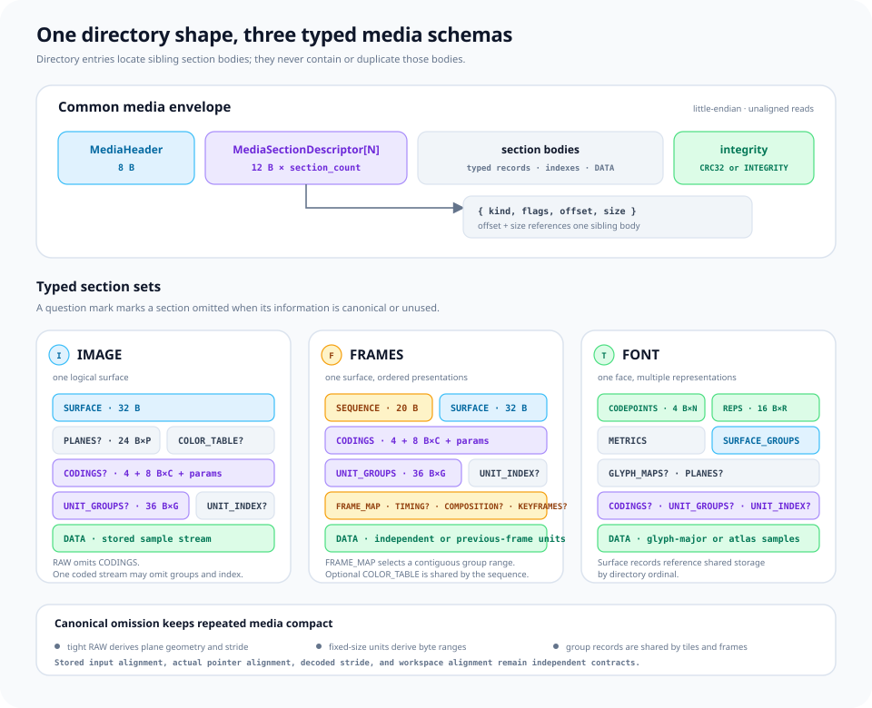

# mirx

MIRX is mirui's ahead-of-time binary asset format. It packages images, fonts, vector scenes, metadata, palettes, and frame sequences into deterministic bytes that can be embedded with `include_bytes!` and consumed directly on constrained targets.

The crate is `no_std + alloc` and separates the allocation-free runtime path from source-backed authoring. A target-gated portable vector dependency accelerates frame residual replay on x86-64, AArch64, and wasm32; unsupported targets retain the scalar path without that dependency.


## Reading path


**Jump to:** [container model](#container-model) · [concrete byte map](#one-file-five-resources) · [runtime reading](#runtime-reading) · [document authoring](#authoring-a-document) · [copy-on-write editing](#copy-on-write-editing) · [checked encoding](#checked-encoding) · [command-line workflow](#command-line-workflow)

## Design at a glance

- **One format, two layouts.** FLAT is the compact single-image path; CHUNK is an ordered container for heterogeneous or repeated assets.
- **Borrow first.** `Reader` validates structure and returns views into the original byte slice.
- **Materialize only what changes.** `Document` keeps untouched payloads borrowed and owns only inserted or edited data.
- **Make unsafe assumptions explicit.** Opaque relocation, critical semantics, reserved bits, and future file semantics require named policies.
- **Plan before writing.** Size, offsets, alignment, representability, and CRCs are checked before output bytes are emitted.

## Two paths through the same bytes


| Goal | Entry point | Allocation model | Result |
| --- | --- | --- | --- |
| Inspect or render | `Reader::open` | Zero allocation | Borrowed container and payload views |
| Validate untrusted input | `Reader::open_with` + `validate_known_payloads` | Zero allocation | Bounded structural and typed validation |
| Modify an existing file | `Document::open` / `from_vec` | CHUNK: one node table | Source-backed, copy-on-write document |
| Build a new file | `Document::new` / `new_flat` | Owned authoring state | Checked FLAT or CHUNK output |

`Reader` and `Document` enforce the same wire rules. The distinction is intent: runtime code reads; tools and build pipelines author.

## Container model


### FLAT

FLAT stores exactly one image. Its header carries format, dimensions, and stride; the plane lengths are derived from that geometry. The main image plane is stored after the header, with an inline palette or alpha plane when required by the format. It is the smallest representation for a standalone image.

### CHUNK

Canonical CHUNK output stores an ordered descriptor table followed by aligned payload ranges. Each descriptor carries a type, flags, offset, and size. The reader also accepts valid relocated tables and payload ranges. A header-level primary selection can expose display hints without decoding every payload.

The six standard payload types are `IMAGE`, `FONT`, `VECTOR`, `META`, `PALETTE`, and `FRAMES`. `ChunkType` also represents every nonzero custom `u16`, allowing unknown payloads to be inspected and preserved.

Primary display hints use a 16-bit `image::SampleLayout`, including planar YUV identifiers. `PrimaryHints::new(layout, width, height, stride)` stores logical dimensions and a byte stride; `SampleLayout::NONE` denotes a primary without a fixed pixel layout. The CHUNK header remains 44 bytes, with the sample-layout field at bytes 22–23.

### One file, five resources


This 1,661-byte layout contains a 44-byte CHUNK header, five 16-byte descriptors, 1,533 payload bytes, and two 2-byte alignment gaps. The two sectioned IMAGE payloads occupy 1,028 and 82 bytes. The VECTOR scene references the preceding IMAGE and FONT chunks by table index without embedding their bytes again.

## Payload families


| Type | Purpose | Read access | Authoring value |
| --- | --- | --- | --- |
| `IMAGE` | RAW and coded packed, indexed, alpha, and planar YUV surfaces | `ImageRef` | `ImageAsset` / `RawImageAsset` / `EncodedImageAsset` |
| `FONT` | Glyph identity, shaping data, placement, and RAW or coded raster representations | `FontView` | `FontAsset` / `Font` |
| `VECTOR` | Ordered scene operations | Bounded decode | `Scene` |
| `META` | Ordered text, bytes, and extension values | `MetaView` | `Meta` |
| `PALETTE` | Ordered RGBA colors | `PaletteView` | `Palette` |
| `FRAMES` | Timed coded surfaces with sparse and previous-frame groups | `FramesView` | `FramesAsset` / `FramesEncoder` / `EncodedFrames` |

IMAGE, FONT, META, PALETTE, and FRAMES expose borrowed views. `ChunkRef::decode_vector` and `DocumentChunkRef::{decode_font, decode_vector}` make owned allocation visible at the call site.

`FontView::open` admits one complete font face: Unicode-to-`GlyphId` lookup, one advance source, one or more raster representations, representation-major raster offsets, and referenced RAW or encoded scalar surfaces. `preflight` accumulates limits across every unique surface and validates DATA once. `FontAsset` writes borrowed authoring input, while owned `Font` retains the same representation and coding structure for transactional document edits. [FONT payload structure](docs/font-payload.md) defines the canonical sections and omission rules.

`FontRepresentations::select` matches fixed-size coverage and ranged signed-distance representations with explicit preferences and fallback. The returned `FontRepresentationMatch` owns one inline metadata value and its source index; selection allocates nothing and does not extend the representation table's lifetime.

`font::RepresentationRecord` is a read-only projection of one stored representation. Sample depth and decoded selection cost come from the bound surface, while fixed Coverage omits repeated range values. `RepresentationAsset` supplies the corresponding semantic authoring value. [Font representation records](docs/font-representations.md) defines the canonical fields and binding checks.

`font::RepresentationTable` borrows representation/surface bodies and resolves scalar storage facts without a decoded metadata array. Native and wire tables share duplicate validation and size selection; count limits precede record interpretation. [Borrowed representation tables](docs/representation-tables.md) describes the bounds and direct iteration API.

`font::GlyphSurfaceRecord` is a read-only projection of shared glyph geometry. RAW physical allocation and encoded coding/group/index references are exclusive states; directory checks do not imply body or DATA validation. `GlyphSurfaceAsset` supplies RAW or encoded storage without exposing directory ordinals. [Glyph surface records](docs/glyph-surfaces.md) describes the fields and omission rules.

`FontView::glyphs(representation_index)` binds the selected representation to its validated scalar map and sample storage. RAW representations return `RawGlyphs` without allocation or repeated DATA scans.

Encoded representations reuse shared coding and group tables. Caller-owned group slots prepare exact glyph plans with bounded unit workspace, partition-aware integrity, sub-byte crops and independently aligned output. [Encoded glyph regions](docs/encoded-glyphs.md) describes whole-stream versus tiled memory costs and metadata lifetimes.

`font::GlyphMap` derives fixed GlyphMajor cells without map bytes or borrows explicit Atlas2D rectangles. Native and stored maps share checked lookup without repeating per-glyph storage rules; typed asset writers own record serialization. See [glyph region maps](docs/glyph-maps.md).

`font::RawGlyphs` binds those maps to scalar sample storage. A shared `PlaneMemoryLayout` describes each independently aligned cell or the complete atlas. Constant-time lookup returns a `GlyphRaster`; its exact region copies into caller-owned output through the image memory and stride contract, without allocating or retaining map metadata. [Borrowed glyph storage](docs/glyph-storage.md) covers cell gaps, sub-byte atlas origins and source/output alignment.

`FontView::map_char` resolves a Unicode scalar to `GlyphId`. `raster_ordinal`, `advance`, `raster_metrics`, `representation`, and `glyphs` keep identity, placement, selection, and sample access separate while borrowing the original payload.

VECTOR keeps ordinary and path-posed glyph runs in separate fixed record layouts. Both layouts cost 18 bytes per glyph; posed runs replace the shaping offset with a normalized tangent and derive the normal during rendering. Projective transforms are shared by scene groups and omitted when identity. [VECTOR payload structure](docs/vector-payload.md) defines the byte layout, ownership boundary, and transform order.

## Runtime reading

`Reader` validates the common header, exact logical length, chunk table, payload ranges, primary selection, and configured resource limits. Chunk iteration and borrowed typed views continue to reference the input bytes.

```rust
use mirx::{ChunkType, Reader, reader::PayloadLimits};

fn inspect(bytes: &[u8]) {
    let reader = Reader::open(bytes).expect("valid MIRX container");

    for chunk in reader.chunks() {
        let _descriptor = (
            chunk.index(),
            chunk.chunk_type().raw(),
            chunk.payload().len(),
        );

        if chunk.chunk_type() == ChunkType::IMAGE {
            let image = chunk
                .image()
                .expect("valid IMAGE payload")
                .expect("IMAGE type");
            if let Some(surface) = image.raw() {
                for plane in surface.planes() {
                    assert!(plane.memory().stride() >= plane.geometry().minimum_stride().unwrap());
                }
            }
        }
    }

    reader
        .validate_known_payloads(&PayloadLimits::EMBEDDED)
        .expect("valid standard payloads");
}
```

`ReadOptions` configures chunk-count limits, payload limits, and trailing-byte handling. `PayloadLimits::EMBEDDED` is the bounded default; `PayloadLimits::HOST` is the explicit larger profile for host tools. FONT and VECTOR provide zero-allocation preflight before bounded decoding.

`Reader` exposes sectioned IMAGE references, including RAW planar YUV and encoded storage, without allocating container metadata. `ChunkRef::image` returns `ImageRef`; use `raw()` for borrowed samples or `encoded()` for explicit group/decode access.

## Image geometry



IMAGE uses an 8-byte media header, 12-byte section entries, a 32-byte SURFACE record, optional PLANES and COLOR_TABLE sections, DATA, and a 4-byte DATA checksum by default. The header contains version, flags, section count, and metadata CRC only. Each section entry stores kind, flags, payload-relative offset, and byte size; typed schemas and surface geometry determine interpreted sizes. Tight RAW planes derive their stride and offsets from the surface; padded allocation extents, strides, offsets, and alignment use explicit plane records. FLAT keeps its compact packed-image layout.

Typed IMAGE, FONT, and FRAMES views validate section ranges and metadata integrity before exposing domain values. RAW views also validate declared DATA coverage before exposing samples. Encoded views separate metadata inspection, profile preflight, selected integrity checks, and reconstruction so callers can budget each stage explicitly.

The metadata CRC covers the header except its own checksum field, the directory, all non-DATA bytes and padding, and the stored DATA checksums. Metadata inspection therefore does not imply that encoded sample bytes have been verified; borrowed-slice readers do not perform streamed file reads.

`DataIntegrity::Indexed` replaces the whole-DATA trailer with a required INTEGRITY section. Its 12-byte offset/size/CRC records partition DATA exactly, without gaps or overlap. Typed group and decode operations select intersecting partitions by binary search and report the actual checksum work; whole-DATA coverage still scans every DATA body for a nonempty request.

`coding::CodingTable` borrows profile IDs, revisions, and parameter slices by ordinal without allocation or aligned casts. A table stores a 4-byte count, 8-byte records, and parameter bytes; cumulative parameter ends give constant-time lookup without separate offset/length pairs. Empty parameters select profile defaults. Unknown IDs and revisions remain representable, not implicitly decodable. RAW images omit CODINGS; the RAW view rejects coded sections.

`image::UnitIndex` resolves exact DATA-relative coded ranges without per-unit geometry. `fixed` derives equal-size ranges and `ranges` borrows ordinary Rust ranges for semantic construction. Stored variable units use adjacent `u32` offsets or `u16`/`u32` lengths with a physical-start checkpoint per 64 units. Fixed and length-table forms derive aligned starts without including padding in codec input. Adjacent iteration is constant-time in both directions; direct and checkpoint lookups stay bounded. See [unit indexes](docs/unit-indexes.md).

`image::UnitSelection` maps compact stored ordinals to selected grid cells. `cells` borrows ordered Rust values for semantic construction. Full stored selections need no map; sparse storage uses sorted `u32` cells or a presence bitmap with population checkpoints every 256 cells. `get` and `position` resolve both directions without allocation.

`SurfaceDescriptor::tile_grid` derives row-major tiles from one shared geometry description. Edge tiles retain the logical surface bounds; joint YUV grids reject interior boundaries that split chroma elements. `Region::for_plane` maps a checked surface region into plane-element coordinates, rounding only an outer odd chroma edge. Packed sub-byte regions stay in sample coordinates. Tile lookup, iteration, and forward/backward skips allocate nothing and take constant time per operation; grid geometry does not change stride or hardware alignment.

`UnitGroup::units_in(region)` selects complete intersecting units in stored order without allocating a table or scanning unrelated cells and empty rows. Joint groups use surface coordinates; planar groups use plane elements. `RegionUnits::work_bound()` reports a conservative traversal-probe bound, separate from decoding and integrity costs. The query does not crop decoded bytes or validate their codec syntax.

`image::UnitGroup::builder(surface, coding, data)` combines shared coding, grid geometry, selected cells, and byte ranges. Whole-surface defaults need no maps; `with_tiles`, `with_selection`, and `with_index` describe regular or sparse units. `get` synthesizes a borrowed `DecodeUnitRef`, and `cell` resolves a selected grid cell. `GroupPlanes` distinguishes joint surface coordinates from independent plane coordinates. Every encoded unit must contain bytes; the index count and total physical span must match the selection and group DATA, including inter-unit gaps. Returned codec slices exclude those gaps. Input offsets and actual pointer alignment are checked separately. A resolved unit does not imply supported profile syntax, verified checksums, or an available reference frame.

Each on-disk group record occupies 36 bytes and stores a coding ordinal, DATA range, index offset, grid geometry, plane selection, reference rule and input alignment. Selection bytes precede range-index bytes in UNIT_INDEX; sizes are derived from the selected forms and counts. Fixed unit size is recovered from the DATA span, selected count and shared alignment, without a redundant size field. Readers resolve records into the same checked `UnitGroup` values used by authoring. One resolved group does not establish cross-group image coverage or checksum integrity.

`surface.validate_coverage(groups, &mut CoverageBudget::new(limit))` checks that groups cover each logical plane exactly once. It combines area checks with overlap detection, supports different tile sizes and mixed joint/planar groups, and allocates no coverage bitmap. Sparse spatial queries use `UnitSelection::range` with bounded prefix-rank lookup. Budget exhaustion returns an error instead of accepting unchecked coverage; callers can retry with a larger operation budget. This geometric check does not validate coding syntax, checksums, or frame references.

`EncodedImageView::open` inspects encoded IMAGE metadata without decoding or scanning DATA. A single coding can omit UNIT_GROUPS and UNIT_INDEX; multiple codings require explicit groups. `groups_into` prepares static coverage in caller-provided `[Option<UnitGroup>]` scratch, validates canonical DATA/index placement and file alignment, and rejects previous-frame references. The returned `ImageGroups` offers allocation-free group lookup and `validate_unit`, which reports actual checksum coverage. Insufficient workspace preserves scratch; other preparation errors may overwrite its used prefix. These APIs expose encoded bytes, not decoded pixels or a guarantee that a coding profile is supported.

`EncodedImageView::validate_groups` checks the same static contract in constant space without a caller group table. It re-resolves immutable records during coverage checks and charges their DATA spans and index-section bytes before parsing, in addition to geometric work. Budget exhaustion is an error. Prepared workspace avoids repeated parsing; neither path substitutes for DATA integrity or codec preflight.

`EncodedImageView::preflight(&limits)` combines static group validation, admitted scalar profiles, exact unit syntax and complete DATA integrity without allocating groups or decoded samples. `PayloadLimits::with_max_raster_groups`, `with_max_raster_units` and `with_max_raster_work` bound shared sample-processing costs; `with_max_decoded_bytes` limits each unit's tight decoded bytes. Shared admission accumulates costs across surfaces and charges DATA integrity separately. Large independently coded images need not fit in one decoded allocation. Empty surfaces still require an understood active profile; unsupported syntax and unit-size failures retain their group/unit locations.

`EncodedImageAsset::new(surface, coding, data)` writes a canonical single-stream IMAGE from borrowed encoded bytes. `from_groups(surface, groups)` accepts borrowed semantic groups, deduplicates coding profiles, chooses compact selection and range tables, and places each group at its requested DATA alignment. Exact sizing, checked caller-buffer encoding and byte comparison allocate nothing. Default single-stream groups/indexes are omitted; palettes remain separate metadata. Authoring validates structural metadata without claiming codec support or decoding DATA; bounded preflight checks complete coverage and syntax. RAW and encoded authoring share `image::ImageEncodeError`. See [encoded images](docs/encoded-images.md) for encode/store/decode examples and validation boundaries.

`ImageRef::open` and `open_at` inspect either RAW or encoded IMAGE storage through one metadata parse. The `Raw(SurfaceView)` and `Encoded(EncodedImageView)` variants expose the same surface and palette metadata but distinct sample-access contracts. `raw()` returns verified borrowed samples; `encoded()` retains explicit group, integrity and decode planning. Dispatch follows CODINGS presence without parser fallback, allocation or implicit decoding.

Execution intent, memory placement, cache boundaries, alignment, and the implemented-versus-verified target ledger are documented in [decode execution and memory](docs/decode-memory.md).

`SurfaceView`, prepared `ImageGroups`, individual `UnitGroup` values, and `FramesPlaybackPlan` report their proven access through `access_capabilities()`. The result distinguishes direct borrowing, whole surfaces, logical rows, independent units, exact regions, progressive delivery, bounded random-frame seeking, and direct upload without treating a representable execution intent as an implemented backend.

Critical IMAGE chunks pass complete RAW or encoded preflight during `Reader::open_with`, using its configured `PayloadLimits`. `validate_known_payloads` applies the same gate explicitly to every implemented standard payload. Unknown encoded profiles remain inspectable in noncritical chunks but fail explicit or critical validation; metadata opening alone never establishes codec support.

`Document::get(id)?.image()` returns `ImageRef`, retaining RAW or encoded storage without allocating samples. `Document::push_image` and `DocumentChunkMut::replace_image` accept decoded `ImageSource` inputs: packed `ImageAsset`, planar `RawImageAsset`, `RawImageView`, or `SurfaceView`. Use `raw()` before accessing planes; its `packed()` projection returns `None` when the color or storage contract cannot be expressed as a packed image.

Encoded payload bytes can be inserted as an atomic `extension::Extension`: bounded preflight establishes the understood contract before mutation. Primary dimensions and sample layout follow the surface; encoded primary stride is zero because output stride belongs to the decode plan. Document reordering and encoding preserve payload bytes and the maximum declared group input alignment. Unknown coding requires an explicit extension policy and is not implicitly decoded for FLAT demotion.

`Document::push_encoded_image` and `DocumentChunkMut::replace_encoded_image` accept `EncodedImageAsset` directly. Metadata, scalar syntax and resource limits are checked before allocating one final payload. Exact canonical replacements retain their existing storage without allocation; a misaligned source position is repaired through owned storage and checked file placement. `EncodedImageAsset::preflight` exposes the same admission checks independently, including a work charge for the complete output span and padding.

`asset.with_integrity(types::DataIntegrity::Indexed(&ends))` selects caller-defined DATA checksum partitions. Cumulative ends cover all DATA, including alignment gaps; the writer computes final offsets and CRCs without a temporary table. Local unit validation reads only intersecting partitions and reports the actual byte count. Whole-DATA CRC remains the default, and full Reader/Document admission still verifies every partition.

`RawImageView::open_at` validates file-relative DATA and plane alignment. `SurfaceView::data_addresses_are_aligned` checks the actual in-memory plane addresses; valid file offsets alone do not make a byte slice suitable for GPU access. `SurfaceRequirements` plans padded allocation dimensions, row strides, and plane addresses without changing the logical image dimensions.

`DecodeRequest` adds execution and memory policy without mixing it into surface geometry. The default reconstructs into CPU memory; advanced image and frame playback plans distinguish memory-mapped Flash, coherent shared memory, non-coherent shared memory, and device-only storage, with independent workspace alignment and directional cache-sync reporting. Frame playback applies the same contract to encoded input, the retained canvas, reusable codec workspace, and restore snapshot. The built-in decoder rejects compute, direct-upload, and CPU-inaccessible buffers before payload preflight instead of pretending that a slice-backed decode can satisfy them. See [decode execution and memory](docs/decode-memory.md).

`SurfaceView::copy_into(output, plan)` transfers logical RAW samples into a caller-owned allocation. Source padding is ignored; destination padding and unused sub-byte row bits become zero. All validation precedes writes, and any output suffix remains unchanged. The returned view borrows the output planes and retains the source's indexed color table without copying it. No allocation or color conversion occurs.

`SurfaceDescriptor::region_plan(region, requirements)` plans an exact cropped allocation with the same sample layout, color, flags and pixel aspect. Interior YUV boundaries must align to chroma samples; packed samples may start inside a byte. `SurfaceView::copy_region_into(output, plan)` copies RAW samples and clears padding. `DecodedUnit::copy_region_into(output, plan)` places only the unit's intersection, preserving other samples and padding. Both paths validate the original source descriptor and caller storage before writes; neither allocates or expands the requested region.

`DecodeUnitRef::memory_plan` applies the same allocation rules to a decoded unit. `UnitMemoryPlan` includes only selected planes; each `UnitPlane` retains its original plane index, source region, local sample geometry, and planned physical layout. Input alignment does not silently become an output requirement. Unit plans preserve odd chroma edges and sub-byte origins, allocate no heap, and validate actual caller-buffer size/address through `buffer_requirements()`. They describe independent unit storage, not in-place writeback into a full-surface buffer.

`coding::Pixel` encodes independent, lossless RGB888/RGBA8888 sample streams with color-cache, delta and run operations. Exact sizing, encoding, preflight and decoding use caller memory without allocation. A validated `PixelDecodePlan` checks destination capacity before writes; failures preserve output. These are tight sample-stream operations, separate from surface stride, media CRC and container editing. See [pixel coding](docs/pixel-coding.md) for the byte format.

`coding::Rle` encodes independent byte or 2/3/4-byte element streams. The default element-size parameter is omitted; literal/run selection compares exact encoded sizes without a temporary buffer. `RleDecodePlan` validates exact input and output counts before caller-buffer decoding, with no heap, cross-unit history or partial failure writes. Element coding alone does not define a surface layout. See [RLE coding](docs/rle-coding.md).

`coding::Lz4` encodes and decodes independent raw LZ4 blocks. `encoder(&mut table)` borrows fixed caller workspace for exact sizing and checked encoding; table size never changes automatically. Decode preflight uses an exact caller-supplied decoded length, and backward references use caller output as history. No frame, size prefix, external dictionary or allocation is required. Errors preserve output, and successful writes retain the suffix. See [LZ4 coding](docs/lz4-coding.md).

`coding::FrameDelta` encodes lossless modulo-256 byte residuals against the same unit in the previous frame. Bounded run and repeating-pattern tokens compact unchanged regions, constant channel changes and interleaved pixels without sample-layout-specific state. FRAMES sessions copy the predictor from the retained canvas into reusable caller workspace, apply residuals in place, then expand into the requested strided and aligned unit layout. `FrameDeltaKernel` separates validated token parsing from residual execution. One private portable 16-byte kernel maps to the vector facilities available on x86-64, AArch64 and wasm32; compact scalar execution remains the default elsewhere, and callers can provide an explicit firmware kernel through `apply_with`. Static IMAGE groups reject this previous-frame profile. Asset generators must compare no-op, sparse-tile, residual and independent-profile sizes because incompressible residuals can exceed RAW. See [frame-delta coding](docs/frame-delta-coding.md).

`FrameSelector` admits already-encoded omitted, keyframe, sparse and delta candidates against loss, recovery-distance, stored-byte, decode-work and workspace limits without allocating. Selection compares complete incremental wire bytes, prefers independent recovery on equal storage, and exposes each rejection for generator reports. See [frame candidate selection](docs/frame-selection.md).

`FramesEncoder` accepts decoded tight frames and emits canonical sectioned FRAMES bytes. It measures whole-frame and changed-tile RAW, RLE, native pixel, LZ4, reversible or explicitly admitted quantized frequency coding, unchanged-frame omission and previous-frame residual candidates; chooses compact sparse selection and range indexes; deduplicates coding records; aligns every selected DATA unit; records independent recovery frames; and returns a per-frame decision report. `FramesAsset::new` provides the allocation-free borrowed path for caller-encoded semantic groups and per-frame group counts without exposing stored records or index tables. Quantized selections are reconstructed before becoming a later frame's predictor. `SurfaceDescriptor::tight_byte_len` derives packed, indexed and YUV input sizes from the same plane stride geometry used by readers, while `with_color_table` binds indexed sequence colors once. See [sectioned frame authoring](docs/frame-authoring.md).

`DecodeUnitRef::decode_plan` combines supported profile preflight with `UnitMemoryPlan`. RAW, PIXEL, RLE and LZ4 units write directly into planned rows, including padded strides and allocation extents, without a tight staging buffer. `CodingRecord::RAW` retains exact logical samples inside explicit groups for uncompressed tiles or mixed compression choices. RAW, RLE and LZ4 support selected packed, indexed, alpha and YUV planes; tight rows are consumed in original plane-index order. LZ4 history crosses rows and planes while excluding physical padding. FrameDelta requires `decode_from(reference, output)` and a previous decoded surface. Actual output address and capacity are checked before writes; padding and unused sub-byte row bits become zero, while suffix bytes stay unchanged. `DecodedUnit` borrows only the destination and exposes `SurfacePlane` row access, while its memory plan retains original source regions. Verify source integrity with `ImageGroups::validate_unit` before executing an encoded unit. Unsupported coding or reference modes fail during planning.

`DecodedUnit::copy_into(output, whole_surface_plan)` places decoded samples at their original plane coordinates without allocation. It preserves other samples, padding and suffix bytes, including adjacent sub-byte pixels in a shared byte. Descriptor and actual output address/capacity checks precede writes. One caller-owned unit buffer can be reused across tiles; this placement operation does not select units, verify complete coverage or preflight a multi-unit request.

`ImageGroups::decode_plan(requirements, limits)` preflights every unit and complete DATA integrity for whole-image scalar reconstruction. `ImageDecodePlan` reports the final memory layout and one reusable workspace sized to the largest tight unit. `decode_into(output, workspace)` checks both buffers before writing, reconstructs all planes and zeroes final padding without allocation. A whole-image stream requires whole-image staging with this path; tiled streams can use a smaller reusable unit buffer. The returned `SurfaceView` borrows output samples and the source's indexed palette. Work limits include preparation and replay; group preparation and coverage are separate, already-completed checks.

`ImageGroups::decode_region_plan(region, requirements, limits)` prepares exact cropped reconstruction through the same plan and caller buffers. Only intersecting units are preflighted and decoded; shared checksum partitions are verified once. `region_plan()` preserves original coordinates, `input_byte_len()` reports selected coded bytes, and `checksum_byte_len()` includes required checksum expansion. Packed sample origins and YUV boundaries remain exact. A small crop still needs workspace for its largest complete selected unit; empty regions require none. No implicit file I/O or color conversion occurs.

```rust
use mirx::{coding::Pixel, image::SampleLayout};

let codec = Pixel::new(SampleLayout::RGB888).unwrap();
let samples = [32, 64, 96, 32, 64, 96];
let mut encoded = [0; 8];
let len = codec.encode_into(&samples, &mut encoded).unwrap();
let plan = codec.plan(&encoded[..len], 2).unwrap();
let mut output = [0; 6];
plan.decode_into(&mut output).unwrap();
assert_eq!(output, samples);
```

`SurfacePlane::row(y)` and `rows()` borrow logical sample rows without allocation. Row indices use each plane's own geometry, including chroma subsampling. Stride padding and allocation-only rows are excluded; unused low bits in a sub-byte row's last byte remain unchanged. Unknown physical storage flags are rejected. These CPU-readable slices do not imply that every row meets GPU address-alignment requirements.

```rust
use mirx::{types::ByteAlignment, image::{ColorDescription, RawImageAsset, SampleLayout, SurfaceDescriptor, SurfaceRequirements}};

#[repr(align(64))]
struct Buffer([u8; 256]);

let surface = SurfaceDescriptor::new(
    2, 2, SampleLayout::NV12, ColorDescription::BT709_YUV_LIMITED,
).unwrap();
let image = RawImageAsset::new(surface, &[&[16; 4], &[128; 2]]).view().unwrap();
let plan = surface.memory_plan(
    SurfaceRequirements::new()
        .with_base_alignment(ByteAlignment::new(64).unwrap())
        .with_plane_alignment(ByteAlignment::new(64).unwrap())
        .with_stride_multiple(64),
).unwrap();
let mut buffer = Buffer([0; 256]);
let copied = image.copy_into(&mut buffer.0, plan).unwrap();
assert_eq!(copied.surface().width(), 2);
assert_eq!(copied.plane(0).unwrap().memory().stride(), 64);
assert!(copied.data_addresses_are_aligned());
let y = copied.plane(0).unwrap();
assert_eq!(y.row(1).unwrap(), Some(&[16, 16][..]));
assert_eq!(y.rows().unwrap().count(), 2);
let uv = copied.plane(1).unwrap();
assert_eq!(uv.rows().unwrap().count(), 1);
```

`ColorFormat::bits_per_pixel()` is the canonical main-plane pixel depth. `ColorFormat::minimum_stride(width)` derives the smallest valid row stride, including sub-byte indexed and alpha formats.

```rust
use mirx::image::ColorFormat;

assert_eq!(ColorFormat::A1.bits_per_pixel(), 1);
assert_eq!(ColorFormat::A1.minimum_stride(13), Some(2));
assert_eq!(ColorFormat::RGB565.bits_per_pixel(), 16);
assert_eq!(ColorFormat::RGB565.minimum_stride(13), Some(26));
assert_eq!(ColorFormat::RGBA8888.bits_per_pixel(), 32);
assert_eq!(ColorFormat::RGBA8888.minimum_stride(13), Some(52));
```

Formats with a separate palette or alpha plane report the depth of the main plane. `ColorFormat::extra_size(width, height, stride)` calculates the required extra-plane byte count.

## Font identity tables

`font::CmapIndex` borrows sorted six-byte records that map Unicode scalars to `GlyphId`. Raster ordinals are identity-mapped when `GLYPH_IDS` is absent; sparse fonts store one sorted glyph ID per raster ordinal. Both paths use binary search without allocation.

```rust
use mirx::font::{CmapIndex, GlyphId};

let bytes = [65, 0, 0, 0, 3, 0, 45, 78, 0, 0, 9, 0];
let cmap = CmapIndex::open(&bytes).unwrap();
assert_eq!(cmap.lookup('中'), Some(GlyphId::new(9)));
assert_eq!(cmap.lookup('B'), None);
```

## Authoring a document


`Document` owns operations that change the collection or container-wide state:

- query with `chunks`, `get`, and `chunks_of_type`;
- append or position opaque chunks with `push_extension`, `insert_extension_before`, and `insert_extension_after`;
- append standard payloads with `push_image`, `push_font`, `push_vector`, `push_meta`, `push_palette`, and `push_frames`;
- remove or reorder with `remove`, `move_before`, and `move_after`;
- manage the primary chunk with `set_primary`, `set_primary_with_hints`, and `clear_primary`;
- convert layouts with `promote_to_chunk` and `demote_to_flat`.

`Document::get_mut(id)` returns a `DocumentChunkMut` scoped to one existing chunk. The handle exposes checked `set_flags`, atomic `replace_extension`, and typed replacement or transactional edit methods. This keeps document-wide operations separate from chunk-local mutation and prevents partial opaque descriptor edits.

```rust
extern crate alloc;

use alloc::borrow::Cow;

use mirx::{Document, document::EncodeOptions, image::{ColorFormat, ImageAsset}};

let pixels = [0_u8, 64, 128, 255];
let stride = ColorFormat::A8.minimum_stride(2).unwrap();
let image = ImageAsset::new(
    2,
    2,
    ColorFormat::A8,
    stride,
    Cow::Borrowed(&pixels),
);

let mut document = Document::new();
let image_id = document.push_image(&image).unwrap();
document.set_primary(image_id).unwrap();

let options = EncodeOptions::new();
let encoded_len = document.encoded_len(&options).unwrap();
let mut output = alloc::vec![0_u8; encoded_len];
let written = document.encode_into(&mut output, &options).unwrap();
assert_eq!(written, encoded_len);
```

`Document::new()` and `Document::default()` create an empty CHUNK document using embedded payload limits. `Document::new_with_limits()` selects a different resource profile. `Document::new_flat(image)` starts with the compact single-image layout.

Chunk IDs remain stable across insert, remove, and reorder operations within a document session. They are not stored in the file and must not be persisted across reopen.

## Copy-on-write editing


Opening a CHUNK document allocates one node table with `O(chunk_count)` entries. Payload bytes stay in the source buffer until an operation needs ownership. A typed edit decodes only the selected payload into a working value. `commit()` validates and encodes the replacement atomically; dropping the working value leaves the document unchanged.

```rust,no_run
use mirx::{ChunkType, Document, meta::MetaEntry};

# fn edit(bytes: &[u8]) -> Result<(), mirx::document::EditError> {
let mut document = Document::open(bytes).expect("valid MIRX container");
let meta_id = document
    .chunks_of_type(ChunkType::META)
    .next()
    .expect("META chunk")
    .id();

let mut edit = document
    .get_mut(meta_id)
    .expect("stable chunk id")
    .edit_meta()?;
edit.push(MetaEntry::text("locale", "en-US")).unwrap();
edit.commit()?;
# Ok(())
# }
```

Typed edit guards implement `DerefMut` to their owned value. Only `commit()` changes the document.

### Typed chunk operations

| Type | Access on `DocumentChunkRef` | Add on `Document` | Edit on `DocumentChunkMut` |
| --- | --- | --- | --- |
| `IMAGE` | `image` | `push_image` | `replace_image` |
| `FONT` | `font`, `decode_font` | `push_font` | `replace_font`, `edit_font` |
| `VECTOR` | `decode_vector` | `push_vector` | `replace_vector`, `edit_vector` |
| `META` | `meta` | `push_meta` | `replace_meta`, `edit_meta` |
| `PALETTE` | `palette` | `push_palette` | `replace_palette`, `edit_palette` |
| `FRAMES` | `frames` | `push_frames` | `replace_frames` |

Typed `push_*` methods use `ChunkFlags::NONE`. Their `push_*_with_flags(value, flags)` counterparts retain explicit descriptor control.

`Meta` and `Palette` use `push`, `insert`, `replace`, and `remove`. `FramesEncoder::push` authors the ordered sequence and `DocumentChunkMut::replace_frames` atomically installs a finished `EncodedFrames` value. `Scene::push` appends an operation.

## Composing typed values

`ImageAsset::new` accepts the required geometry and main plane. `with_extra` adds an inline palette or alpha plane only when the selected format needs one.

FRAMES construction reuses the sectioned surface model:

```rust,no_run
use mirx::{types::ByteAlignment, Document, frames::{FrameSequence, FramesEncoder}, image::{ColorDescription, SampleLayout, SurfaceDescriptor}};

let surface = SurfaceDescriptor::new(2, 1, SampleLayout::RGBA8888, ColorDescription::SRGB).unwrap();
let sequence = FrameSequence::new(1, 1_000, 40).unwrap();
let mut encoder = FramesEncoder::new(sequence, surface)
    .unwrap()
    .with_input_alignment(ByteAlignment::new(64).unwrap())
    .unwrap();
encoder.push(&[255, 0, 0, 255, 0, 0, 0, 255]).unwrap();
let mut document = Document::new();
let id = document.push_frames(encoder.finish().unwrap()).unwrap();
let frames = document.get(id).unwrap().frames().unwrap();
# let _ = frames;
```

`FrameSequence` owns the shared clock, default duration, composition defaults, loop count, and maximum recovery distance. `FramesEncoder::push` uses the shared duration, while `push_with_duration` stores only non-default per-frame timing through the compact timing section. The encoder chooses the stored representation for each pushed surface and returns one immutable `EncodedFrames` value for insertion or replacement.

`FramesView::group_workspace_len` reports planning scratch before scratch is supplied. `playback_plan` then validates every frame and reports exact aligned canvas, reusable unit-workspace and optional disposal-backup requirements. `FramesPlaybackPlan::bind(PlaybackStorage { .. })` names each caller-owned buffer, validates every capacity and runtime address, and creates a `FrameSession`. `present(frame)` reuses forward state or restarts from the closest bounded recovery frame; no storage or integrity failure is deferred past binding. `FramesView::timeline` maps absolute ticks to `FramePosition` using variable durations and finite or unbounded play counts without allocating a cumulative table. Sparse replacement groups and previous-frame residual groups share the same unit geometry, integrity and alignment contracts.

## Checked encoding


- `finish()` returns the exact original bytes when an opened document is unchanged. Borrowed input stays borrowed; owned input retains its allocation.
- `encoded_len()` validates the document and computes the exact output size.
- `encode_into()` writes into caller-provided storage without allocating the output and leaves the unused suffix untouched.
- `encode()` performs one exact-size output allocation after planning.
- `LayoutPolicy` selects preserve-or-promote, smallest representable, forced FLAT, or forced CHUNK output.

Modified CHUNK output is deterministic: descriptor order is stable, padding is canonical, payload alignment is checked, primary hints are derived from typed payloads when possible, and CRCs cover the defined envelope.

## Opaque extensions

An `Extension` carries type, flags, payload ownership, and rewrite policy as one value:

```rust,no_run
use mirx::{
    ChunkFlags, ChunkType,
    extension::{Critical, Extension, Policy, Relocation, ReservedFlags},
};

# let payload: &[u8] = &[];
let policy = Policy::infer()
    .with_relocation(Relocation::AssumeRelocatable)
    .with_critical_semantics(Critical::AssumeCriticalUnderstood)
    .with_reserved_bits(ReservedFlags::Preserve);

let extension = Extension::borrowed(ChunkType::new(0x8000).unwrap(), payload)
    .with_flags(ChunkFlags::CRITICAL)
    .with_policy(policy);
# let _ = extension;
```

- `Relocation` controls whether opaque payload bytes may move.
- `Critical` records whether a critical custom contract is understood.
- `ReservedFlags` rejects, preserves, or normalizes reserved flag bits.
- `SourcePolicy` grants a policy to matching source chunks during open.

Reader and document opening accept only the current MIRX container version and zero file flags. Unknown chunk types and coding identifiers remain representable within that current container. Preserved trailing bytes remain read-only until `discard_trailing_bytes()` is called.

## Command-line workflow

The workspace `xtask` provides inspection, validation, extraction, and guarded raw editing:

```text
cargo xtask mirx inspect <file>
cargo xtask mirx validate <file> [--known-payloads]
cargo xtask mirx extract <file> --index <n> --out <payload> [guards]
cargo xtask mirx insert <file> --type <u16> --payload <path> [--flags <u16>] [raw policy options]
cargo xtask mirx replace <file> --index <n> --payload <path> [guards] [raw policy options]
cargo xtask mirx remove <file> --index <n> [guards] [raw policy options]
cargo xtask mirx move <file> --index <n> (--before <n> | --after <n>) [guards] [raw policy options]
cargo xtask mirx set-primary <file> --index <n> [--hints <sample-layout,width,height,stride>] [guards] [raw policy options]
cargo xtask mirx clear-primary <file> [guards] [raw policy options]
```

Guards prevent an index-based script from acting on stale content:

```text
--expect-type <u16> --expect-crc <u32>
```

Raw policy options make opaque rewrite authority explicit:

```text
--assume-relocatable --assume-critical-understood
--assume-relocatable-type <u16> --assume-critical-type <u16>
--preserve-reserved-flags | --normalize-reserved-flags
```

Decimal and `0x`-prefixed values are accepted. File edits are failure-safe: the complete result is encoded to a sibling temporary file, flushed, assigned the original permissions, and atomically renamed over the input only after every check succeeds.

## Guarantees

| Property | Guarantee |
| --- | --- |
| Runtime allocation | Reader open, iteration, findings, and borrowed views allocate nothing |
| Resource control | Chunk counts, decoded records, and payload sizes are bounded by profiles |
| Edit atomicity | Failed typed or structural edits leave document state unchanged |
| No-op identity | An unchanged document returns its original bytes exactly |
| Output stability | Modified documents use deterministic ordering, padding, and metadata |
| Open registries | Unknown chunk types and coding identifiers are preserved in current containers |
| Portability | `no_std + alloc`, Rust 1.85 compatible; target-gated portable vectors with scalar fallback |

## License

MIT.
