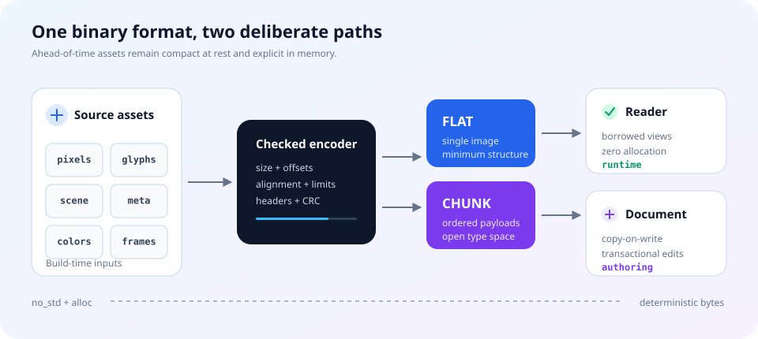
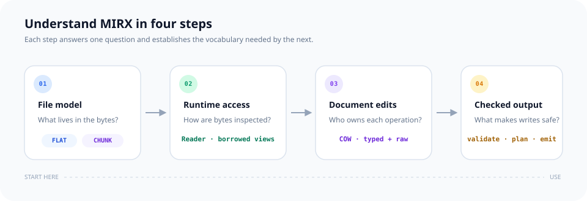
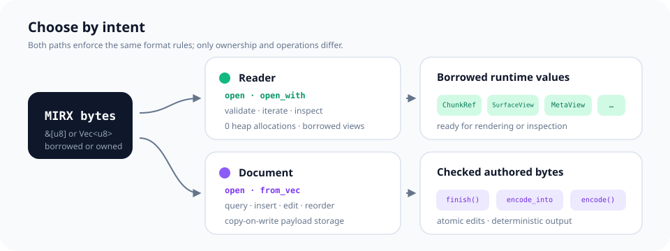
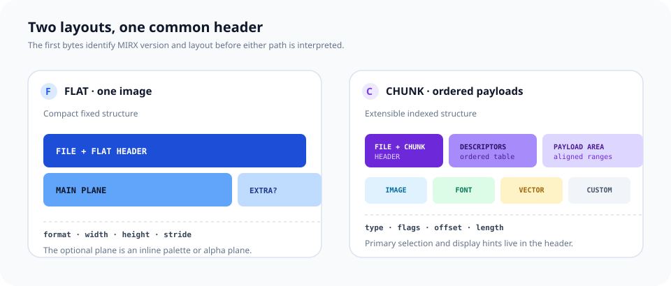
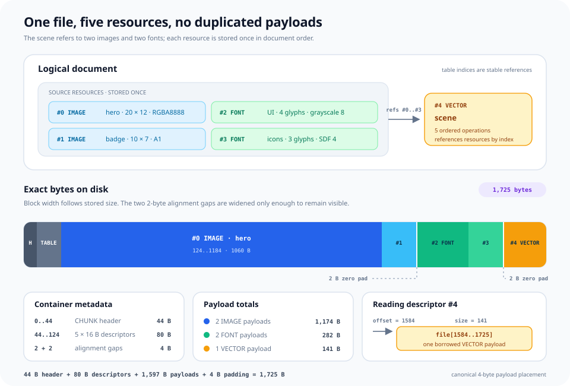
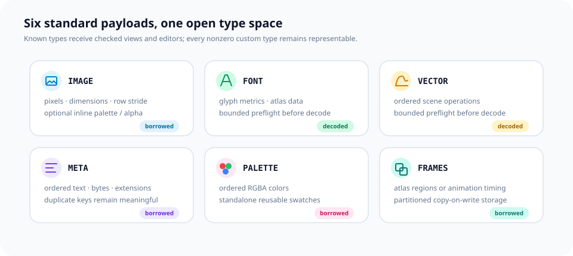
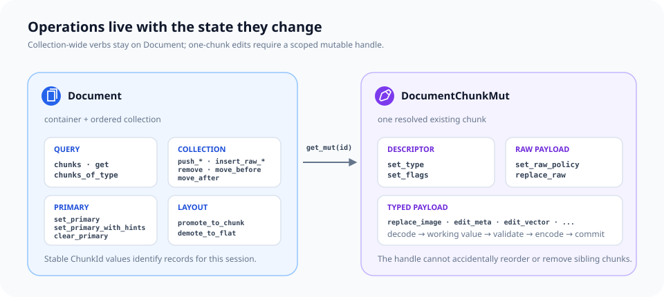
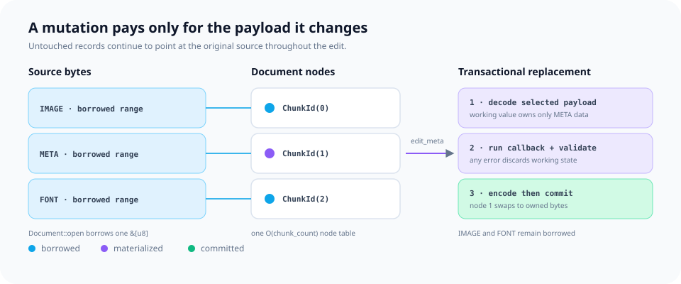
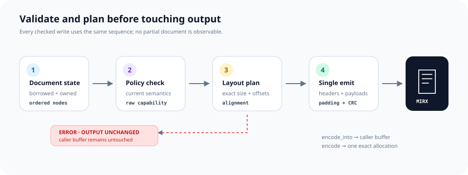

# mirx

MIRX is mirui's ahead-of-time binary asset format. It packages images, fonts, vector scenes, metadata, palettes, and frame sequences into deterministic bytes that can be embedded with `include_bytes!` and consumed directly on constrained targets.

The crate is `no_std + alloc`, has no external dependencies, and separates the allocation-free runtime path from source-backed authoring.



## Reading path



**Jump to:** [container model](#container-model) · [concrete byte map](#one-file-five-resources) · [runtime reading](#runtime-reading) · [document authoring](#authoring-a-document) · [copy-on-write editing](#copy-on-write-editing) · [checked encoding](#checked-encoding) · [command-line workflow](#command-line-workflow)

## Design at a glance

- **One format, two layouts.** FLAT is the compact single-image path; CHUNK is an ordered container for heterogeneous or repeated assets.
- **Borrow first.** `Reader` validates structure and returns views into the original byte slice.
- **Materialize only what changes.** `Document` keeps untouched payloads borrowed and owns only inserted or edited data.
- **Make unsafe assumptions explicit.** Opaque relocation, critical semantics, reserved bits, and future file semantics require named policies.
- **Plan before writing.** Size, offsets, alignment, representability, and CRCs are checked before output bytes are emitted.

## Two paths through the same bytes



| Goal | Entry point | Allocation model | Result |
| --- | --- | --- | --- |
| Inspect or render | `Reader::open` | Zero allocation | Borrowed container and payload views |
| Validate untrusted input | `Reader::open_with` + `validate_known_payloads` | Zero allocation | Bounded structural and typed validation |
| Modify an existing file | `Document::open` / `from_vec` | CHUNK: one node table | Source-backed, copy-on-write document |
| Build a new file | `Document::new` / `new_flat` | Owned authoring state | Checked FLAT or CHUNK output |

`Reader` and `Document` enforce the same wire rules. The distinction is intent: runtime code reads; tools and build pipelines author.

## Container model



### FLAT

FLAT stores exactly one image. Its header carries format, dimensions, and stride; the plane lengths are derived from that geometry. The main image plane is stored after the header, with an inline palette or alpha plane when required by the format. It is the smallest representation for a standalone image.

### CHUNK

Canonical CHUNK output stores an ordered descriptor table followed by aligned payload ranges. Each descriptor carries a type, flags, offset, and size. The reader also accepts valid relocated tables and payload ranges. A header-level primary selection can expose display hints without decoding every payload.

The six standard payload types are `IMAGE`, `FONT`, `VECTOR`, `META`, `PALETTE`, and `FRAMES`. `ChunkType` also represents every nonzero custom `u16`, allowing unknown payloads to be inspected and preserved.

Primary display hints use a 16-bit `image::SampleLayout`, including planar YUV identifiers. `PrimaryHints::new(layout, width, height, stride)` stores logical dimensions and a byte stride; `SampleLayout::NONE` denotes a primary without a fixed pixel layout. The CHUNK header remains 44 bytes, with the sample-layout field at bytes 22–23.

### One file, five resources



This 1,661-byte layout contains a 44-byte CHUNK header, five 16-byte descriptors, 1,533 payload bytes, and two 2-byte alignment gaps. The two sectioned IMAGE payloads occupy 1,028 and 82 bytes. The VECTOR scene references the preceding IMAGE and FONT chunks by table index without embedding their bytes again.

## Payload families



| Type | Purpose | Read access | Authoring value |
| --- | --- | --- | --- |
| `IMAGE` | RAW and coded packed, indexed, alpha, and planar YUV surfaces | `ImageRef` | `ImageAsset` / `RawImageAsset` / `EncodedImageAsset` |
| `FONT` | Glyph metrics and atlas data | Bounded decode | `Font` |
| `VECTOR` | Ordered scene operations | Bounded decode | `Scene` |
| `META` | Ordered text, bytes, and extension values | `MetaView` | `Meta` |
| `PALETTE` | Ordered RGBA colors | `PaletteView` | `Palette` |
| `FRAMES` | Atlas regions or timed animation frames | `FramesView` | `FramesAsset` |

IMAGE, META, PALETTE, and FRAMES expose borrowed views. FONT and VECTOR use `decode_font` and `decode_vector` to make their owned allocation visible at the call site.

`FontRepresentations::select` matches fixed-size coverage and ranged signed-distance representations with explicit preferences and fallback. The returned `FontRepresentationMatch` owns one inline metadata value and its source index; selection allocates nothing and does not extend the representation table's lifetime.

`font::RepresentationRecord` encodes 16 bytes of size semantics and shared surface/map references. Sample depth and decoded selection cost come from the bound surface, while fixed Coverage omits repeated range values. [Font representation records](docs/font-representations.md) defines canonical fields and native binding checks.

`font::MetricsTable` borrows representation-specific line and glyph measurements as signed 24.8 values, without repeating codepoints or raster storage fields. [Font metric records](docs/font-metrics.md) describes the byte layout, coordinate conventions and allocation-free access.

`font::GlyphMap` derives fixed GlyphMajor cells without map bytes or borrows explicit Atlas2D rectangles. Native and wire maps share checked lookup and encoding without repeating per-glyph storage rules; see [glyph region maps](docs/glyph-maps.md).

`font::RawGlyphs` binds those maps to scalar sample storage. A shared `PlaneMemoryLayout` describes each independently aligned cell or the complete atlas. Constant-time lookup returns a `GlyphRaster`; its exact region copies into caller-owned output through the image memory and stride contract, without allocating or retaining map metadata. [Borrowed glyph storage](docs/glyph-storage.md) covers cell gaps, sub-byte atlas origins and source/output alignment.

`font::GlyphTable` joins shared codepoints, representation metrics and RAW glyph storage after checking equal counts. `glyph(char)` returns matching measurements and samples through one ordinal; the result borrows only sample bytes. [Joined glyph lookup](docs/glyph-lookup.md) covers missing characters, empty raster regions and design-ppem metrics.

## Runtime reading

`Reader` validates the common header, exact logical length, chunk table, payload ranges, primary selection, and configured resource limits. Chunk iteration and borrowed typed views continue to reference the input bytes.

```rust
use mirx::{ChunkType, PayloadLimits, Reader};

fn inspect(bytes: &[u8]) {
    let reader = Reader::open(bytes).expect("valid MIRX container");

    for chunk in reader.chunks() {
        let _descriptor = (
            chunk.index(),
            chunk.chunk_type().raw(),
            chunk.payload().len(),
        );

        if chunk.chunk_type() == ChunkType::IMAGE {
            let image = chunk
                .image()
                .expect("valid IMAGE payload")
                .expect("IMAGE type");
            if let Some(surface) = image.raw() {
                for plane in surface.planes() {
                    assert!(plane.memory().stride() >= plane.geometry().minimum_stride().unwrap());
                }
            }
        }
    }

    reader
        .validate_known_payloads(&PayloadLimits::EMBEDDED)
        .expect("valid standard payloads");
}
```

`ReadOptions` configures chunk-count limits, payload limits, and trailing-byte handling. `PayloadLimits::EMBEDDED` is the bounded default; `PayloadLimits::HOST` is the explicit larger profile for host tools. FONT and VECTOR provide zero-allocation preflight before bounded decoding.

`parse`, `parse_flat`, and `parse_chunk` expose owned container metadata and packed image views. `Reader` exposes sectioned IMAGE references, including RAW planar YUV and encoded storage, without allocating container metadata. `ChunkRef::image` returns `ImageRef`; use `raw()` for borrowed samples or `encoded()` for explicit group/decode access.

## Image geometry

IMAGE uses an 8-byte media header, 12-byte section entries, a 32-byte SURFACE record, optional PLANES and COLOR_TABLE sections, DATA, and a 4-byte DATA checksum by default. The header contains version, flags, section count, and metadata CRC only. Each section entry stores kind, flags, payload-relative offset, and byte size; typed schemas and surface geometry determine interpreted sizes. Tight RAW planes derive their stride and offsets from the surface; padded allocation extents, strides, offsets, and alignment use explicit plane records. FLAT keeps its compact packed-image layout.

`MediaPayload::open` validates section ranges and metadata integrity without scanning DATA. The metadata CRC covers the header except its own checksum field, the directory, all non-DATA bytes and padding, and the stored DATA checksums. `MediaPayload::validate_data` separately verifies all declared DATA coverage. `RawImageView::open` and `open_at` perform both checks before exposing samples. Metadata inspection therefore does not imply that sample bytes have been verified; this borrowed-slice API does not perform streamed file reads.

`MediaFlags::INDEXED_INTEGRITY` replaces the whole-DATA trailer with a required INTEGRITY section. Its 12-byte offset/size/CRC records partition DATA exactly, without gaps, overlapping checksums, or metadata coverage. `MediaPayload::validate_data_range` locates intersecting records by binary search and returns the actual number of bytes checksummed; the default integrity form still requires scanning all DATA for a partial request. `media::IntegrityTable` exposes borrowed records and checked caller-buffer encoding. RAW typed reads validate either form before exposing samples.

`MediaPayload::data_check_plan(range)` reports that checksum byte count before scanning DATA. `DataCheckPlan::byte_len()` includes complete intersecting partitions, or all DATA bodies for whole-DATA coverage. `verify()` performs the planned checks; constructing a plan alone does not establish integrity. Planning and verification allocate nothing and perform no I/O.

`media::CodingTable` borrows profile IDs, revisions, and parameter slices by ordinal without allocation or aligned casts. A table stores a 4-byte count, 8-byte records, and parameter bytes; cumulative parameter ends give constant-time lookup without separate offset/length pairs. Empty parameters select profile defaults. Unknown IDs and revisions remain representable, not implicitly decodable. RAW images omit CODINGS; the RAW view rejects coded sections.

`media::UnitIndex` resolves exact DATA-relative coded ranges without per-unit geometry. Fixed-size units need no table; variable units use adjacent `u32` offsets or `u16`/`u32` lengths with a physical-start checkpoint per 64 units. Fixed and length-table forms derive aligned starts without including padding in codec input. Adjacent iteration is constant-time in both directions; checkpoint lookup reads at most 63 preceding lengths. `UnitIndexEncoding` validates and writes caller-supplied lengths without allocation, silently changing forms, or touching output on error. See [unit indexes](docs/unit-indexes.md).

`media::UnitSelection` maps compact stored ordinals to selected grid cells. Full selection needs no map; sparse selection uses sorted `u32` cells or a presence bitmap with population checkpoints every 256 cells. Bitmap lookup reads at most 32 bitmap bytes after locating a checkpoint, without scanning earlier cells. `get` and `position` resolve both directions; `UnitSelectionEncoding` writes either sparse form into caller-owned storage without allocating or changing output on error.

`SurfaceDescriptor::tile_grid` derives row-major tiles from one shared geometry description. Edge tiles retain the logical surface bounds; joint YUV grids reject interior boundaries that split chroma elements. `Region::for_plane` maps a checked surface region into plane-element coordinates, rounding only an outer odd chroma edge. Packed sub-byte regions stay in sample coordinates. Tile lookup, iteration, and forward/backward skips allocate nothing and take constant time per operation; grid geometry does not change stride or hardware alignment.

`UnitGroup::units_in(region)` selects complete intersecting units in stored order without allocating a table or scanning unrelated cells and empty rows. Joint groups use surface coordinates; planar groups use plane elements. `RegionUnits::work_bound()` reports a conservative traversal-probe bound, separate from decoding and integrity costs. The query does not crop decoded bytes or validate their codec syntax.

`image::UnitGroup::builder(surface, coding, data)` combines shared coding, grid geometry, selected cells, and byte ranges. Whole-surface defaults need no maps; `with_tiles`, `with_selection`, and `with_index` describe regular or sparse units. `get` synthesizes a borrowed `DecodeUnitRef`, and `cell` resolves a selected grid cell. `GroupPlanes` distinguishes joint surface coordinates from independent plane coordinates. Every encoded unit must contain bytes; the index count and total physical span must match the selection and group DATA, including inter-unit gaps. Returned codec slices exclude those gaps. Input offsets and actual pointer alignment are checked separately. A resolved unit does not imply supported profile syntax, verified checksums, or an available reference frame.

`UnitGroupRecord` reads and writes a 36-byte shared group record. It stores a coding ordinal, DATA range, index offset, grid geometry, plane selection, reference rule, and input alignment. Selection bytes precede range-index bytes in UNIT_INDEX; sizes are derived from the selected forms and counts. Fixed unit size is recovered from the DATA span, selected count and shared alignment, without a redundant size field. `resolve` combines the record with borrowed SURFACE, CODINGS, DATA, and UNIT_INDEX values through the same checked `UnitGroup` path. Its result validates one group, not cross-group image coverage or checksum integrity.

`surface.validate_coverage(groups, &mut CoverageBudget::new(limit))` checks that groups cover each logical plane exactly once. It combines area checks with overlap detection, supports different tile sizes and mixed joint/planar groups, and allocates no coverage bitmap. Sparse spatial queries use `UnitSelection::range` with bounded prefix-rank lookup. Budget exhaustion returns an error instead of accepting unchecked coverage; callers can retry with a larger operation budget. This geometric check does not validate coding syntax, checksums, or frame references.

`EncodedImageView::open` inspects encoded IMAGE metadata without decoding or scanning DATA. A single coding can omit UNIT_GROUPS and UNIT_INDEX; multiple codings require explicit groups. `groups_into` prepares static coverage in caller-provided `[Option<UnitGroup>]` scratch, validates canonical DATA/index placement and file alignment, and rejects previous-frame references. The returned `ImageGroups` offers allocation-free group lookup and `validate_unit`, which reports actual checksum coverage. Insufficient workspace preserves scratch; other preparation errors may overwrite its used prefix. These APIs expose encoded bytes, not decoded pixels or a guarantee that a coding profile is supported.

`EncodedImageView::validate_groups` checks the same static contract in constant space without a caller group table. It re-resolves immutable records during coverage checks and charges their DATA spans and index-section bytes before parsing, in addition to geometric work. Budget exhaustion is an error. Prepared workspace avoids repeated parsing; neither path substitutes for DATA integrity or codec preflight.

`EncodedImageView::preflight(&limits)` combines static group validation, admitted scalar profiles, exact unit syntax and complete DATA integrity without allocating groups or decoded samples. `PayloadLimits` bounds IMAGE groups, units, conservative work and each unit's tight decoded bytes. Large independently coded images need not fit in one decoded allocation. Empty surfaces still require an understood active profile; unsupported syntax and unit-size failures retain their group/unit locations.

`EncodedImageAsset::new(surface, coding, data)` writes a canonical single-stream IMAGE from borrowed encoded bytes. `from_groups(surface, &codings, &groups, data).with_index(bytes)` accepts shared profiles, planar or tiled groups and optional compact indexes. Exact sizing, checked caller-buffer encoding and byte comparison allocate nothing. Default single-stream groups/indexes are omitted; explicit groups own their input alignment, and palettes remain separate metadata. Authoring validates structural metadata without claiming codec support or decoding DATA; bounded preflight checks complete coverage and syntax. RAW and encoded authoring share `image::ImageEncodeError`. See [encoded images](docs/encoded-images.md) for encode/store/decode examples and validation boundaries.

`ImageRef::open` and `open_at` inspect either RAW or encoded IMAGE storage through one metadata parse. The `Raw(SurfaceView)` and `Encoded(EncodedImageView)` variants expose the same surface and palette metadata but distinct sample-access contracts. `raw()` returns verified borrowed samples; `encoded()` retains explicit group, integrity and decode planning. Dispatch follows CODINGS presence without parser fallback, allocation or implicit decoding.

Critical IMAGE chunks pass complete RAW or encoded preflight during `Reader::open_with`, using its configured `PayloadLimits`. `validate_known_payloads` applies the same gate explicitly to every implemented standard payload. Unknown encoded profiles remain inspectable in noncritical chunks but fail explicit or critical validation; metadata opening alone never establishes codec support.

`Document::image` returns `ImageRef`, retaining RAW or encoded storage without allocating samples. `Document::push_image` and `DocumentChunkMut::replace_image` accept decoded `ImageSource` inputs: packed `ImageAsset`, planar `RawImageAsset`, `RawImageView`, or `SurfaceView`. Use `raw()` before accessing planes; its `packed()` projection returns `None` when the color or storage contract cannot be expressed as a packed image.

Encoded payload bytes can be inserted through `push_raw` with `RawChunkPolicy::infer()`: bounded preflight establishes the understood contract before mutation. Primary dimensions and sample layout follow the surface; encoded primary stride is zero because output stride belongs to the decode plan. Document reordering and encoding preserve payload bytes and the maximum declared group input alignment. Unknown coding requires explicit raw capability assumptions and is not implicitly decoded for FLAT demotion.

`Document::push_encoded_image` and `DocumentChunkMut::replace_encoded_image` accept `EncodedImageAsset` directly. Metadata, scalar syntax and resource limits are checked before allocating one final payload. Exact canonical replacements retain their existing storage without allocation; a misaligned source position is repaired through owned storage and checked file placement. `EncodedImageAsset::preflight` exposes the same admission checks independently, including a work charge for the complete output span and padding.

`asset.with_integrity(media::DataIntegrity::Indexed(&ends))` selects caller-defined DATA checksum partitions. Cumulative ends cover all DATA, including alignment gaps; the writer computes final offsets and CRCs without a temporary table. Local unit validation reads only intersecting partitions and reports the actual byte count. Whole-DATA CRC remains the default, and full Reader/Document admission still verifies every partition.

`RawImageView::open_at` validates file-relative DATA and plane alignment. `SurfaceView::data_addresses_are_aligned` checks the actual in-memory plane addresses; valid file offsets alone do not make a byte slice suitable for GPU access. `SurfaceRequirements` plans padded allocation dimensions, row strides, and plane addresses without changing the logical image dimensions.

`SurfaceView::copy_into(output, plan)` transfers logical RAW samples into a caller-owned allocation. Source padding is ignored; destination padding and unused sub-byte row bits become zero. All validation precedes writes, and any output suffix remains unchanged. The returned view borrows the output planes and retains the source's indexed color table without copying it. No allocation or color conversion occurs.

`SurfaceDescriptor::region_plan(region, requirements)` plans an exact cropped allocation with the same sample layout, color, flags and pixel aspect. Interior YUV boundaries must align to chroma samples; packed samples may start inside a byte. `SurfaceView::copy_region_into(output, plan)` copies RAW samples and clears padding. `DecodedUnit::copy_region_into(output, plan)` places only the unit's intersection, preserving other samples and padding. Both paths validate the original source descriptor and caller storage before writes; neither allocates or expands the requested region.

`DecodeUnitRef::memory_plan` applies the same allocation rules to a decoded unit. `UnitMemoryPlan` includes only selected planes; each `UnitPlane` retains its original plane index, source region, local sample geometry, and planned physical layout. Input alignment does not silently become an output requirement. Unit plans preserve odd chroma edges and sub-byte origins, allocate no heap, and validate actual caller-buffer size/address through `buffer_requirements()`. They describe independent unit storage, not in-place writeback into a full-surface buffer.

`coding::Pixel` encodes independent, lossless RGB888/RGBA8888 sample streams with color-cache, delta and run operations. Exact sizing, encoding, preflight and decoding use caller memory without allocation. A validated `PixelDecodePlan` checks destination capacity before writes; failures preserve output. These are tight sample-stream operations, separate from surface stride, media CRC and container editing. See [pixel coding](docs/pixel-coding.md) for the byte format.

`coding::Rle` encodes independent byte or 2/3/4-byte element streams. The default element-size parameter is omitted; literal/run selection compares exact encoded sizes without a temporary buffer. `RleDecodePlan` validates exact input and output counts before caller-buffer decoding, with no heap, cross-unit history or partial failure writes. Element coding alone does not define a surface layout. See [RLE coding](docs/rle-coding.md).

`coding::Lz4` encodes and decodes independent raw LZ4 blocks. `encoder(&mut table)` borrows fixed caller workspace for exact sizing and checked encoding; table size never changes automatically. Decode preflight uses an exact caller-supplied decoded length, and backward references use caller output as history. No frame, size prefix, external dictionary or allocation is required. Errors preserve output, and successful writes retain the suffix. See [LZ4 coding](docs/lz4-coding.md).

`DecodeUnitRef::decode_plan` combines supported profile preflight with `UnitMemoryPlan`. RAW, PIXEL, RLE and LZ4 units write directly into planned rows, including padded strides and allocation extents, without a tight staging buffer. `CodingRecord::RAW` retains exact logical samples inside explicit groups for uncompressed tiles or mixed compression choices. RAW, RLE and LZ4 support selected packed, indexed, alpha and YUV planes; tight rows are consumed in original plane-index order. LZ4 history crosses rows and planes while excluding physical padding. Actual output address and capacity are checked before writes; padding and unused sub-byte row bits become zero, while suffix bytes stay unchanged. `DecodedUnit` borrows only the destination and exposes `SurfacePlane` row access, while its memory plan retains original source regions. Verify source integrity with `ImageGroups::validate_unit` before executing an encoded IMAGE unit. Unsupported coding or frame references fail during planning.

`DecodedUnit::copy_into(output, whole_surface_plan)` places decoded samples at their original plane coordinates without allocation. It preserves other samples, padding and suffix bytes, including adjacent sub-byte pixels in a shared byte. Descriptor and actual output address/capacity checks precede writes. One caller-owned unit buffer can be reused across tiles; this placement operation does not select units, verify complete coverage or preflight a multi-unit request.

`ImageGroups::decode_plan(requirements, limits)` preflights every unit and complete DATA integrity for whole-image scalar reconstruction. `ImageDecodePlan` reports the final memory layout and one reusable workspace sized to the largest tight unit. `decode_into(output, workspace)` checks both buffers before writing, reconstructs all planes and zeroes final padding without allocation. A whole-image stream requires whole-image staging with this path; tiled streams can use a smaller reusable unit buffer. The returned `SurfaceView` borrows output samples and the source's indexed palette. Work limits include preparation and replay; group preparation and coverage are separate, already-completed checks.

`ImageGroups::decode_region_plan(region, requirements, limits)` prepares exact cropped reconstruction through the same plan and caller buffers. Only intersecting units are preflighted and decoded; shared checksum partitions are verified once. `region_plan()` preserves original coordinates, `input_byte_len()` reports selected coded bytes, and `checksum_byte_len()` includes required checksum expansion. Packed sample origins and YUV boundaries remain exact. A small crop still needs workspace for its largest complete selected unit; empty regions require none. No implicit file I/O or color conversion occurs.

```rust
use mirx::{coding::Pixel, image::SampleLayout};

let codec = Pixel::new(SampleLayout::RGB888).unwrap();
let samples = [32, 64, 96, 32, 64, 96];
let mut encoded = [0; 8];
let len = codec.encode_into(&samples, &mut encoded).unwrap();
let plan = codec.plan(&encoded[..len], 2).unwrap();
let mut output = [0; 6];
plan.decode_into(&mut output).unwrap();
assert_eq!(output, samples);
```

`SurfacePlane::row(y)` and `rows()` borrow logical sample rows without allocation. Row indices use each plane's own geometry, including chroma subsampling. Stride padding and allocation-only rows are excluded; unused low bits in a sub-byte row's last byte remain unchanged. Unknown physical storage flags are rejected. These CPU-readable slices do not imply that every row meets GPU address-alignment requirements.

```rust
use mirx::image::{ColorDescription, RawImageAsset, SampleLayout, SurfaceDescriptor, SurfaceRequirements};

#[repr(align(64))]
struct Buffer([u8; 256]);

let surface = SurfaceDescriptor::new(
    2, 2, SampleLayout::NV12, ColorDescription::BT709_YUV_LIMITED,
).unwrap();
let image = RawImageAsset::new(surface, &[&[16; 4], &[128; 2]]).view().unwrap();
let plan = surface.memory_plan(
    SurfaceRequirements::new()
        .with_base_alignment(64)
        .with_plane_alignment(64)
        .with_stride_multiple(64),
).unwrap();
let mut buffer = Buffer([0; 256]);
let copied = image.copy_into(&mut buffer.0, plan).unwrap();
assert_eq!(copied.surface().width(), 2);
assert_eq!(copied.plane(0).unwrap().memory().stride(), 64);
assert!(copied.data_addresses_are_aligned());
let y = copied.plane(0).unwrap();
assert_eq!(y.row(1).unwrap(), Some(&[16, 16][..]));
assert_eq!(y.rows().unwrap().count(), 2);
let uv = copied.plane(1).unwrap();
assert_eq!(uv.rows().unwrap().count(), 1);
```

`ColorFormat::bits_per_pixel()` is the canonical main-plane pixel depth. `ColorFormat::minimum_stride(width)` derives the smallest valid row stride, including sub-byte indexed and alpha formats.

```rust
use mirx::ColorFormat;

assert_eq!(ColorFormat::A1.bits_per_pixel(), 1);
assert_eq!(ColorFormat::A1.minimum_stride(13), Some(2));
assert_eq!(ColorFormat::RGB565.bits_per_pixel(), 16);
assert_eq!(ColorFormat::RGB565.minimum_stride(13), Some(26));
assert_eq!(ColorFormat::RGBA8888.bits_per_pixel(), 32);
assert_eq!(ColorFormat::RGBA8888.minimum_stride(13), Some(52));
```

Formats with a separate palette or alpha plane report the depth of the main plane. `ColorFormat::extra_size(width, height, stride)` calculates the required extra-plane byte count.

## Font codepoint tables

`FontCodepoints` borrows a CODEPOINTS section body: strictly increasing little-endian `u32` Unicode scalar values. It rejects surrogates, out-of-range values, duplicates, unordered records, and partial entries. Glyph ordinals come from table positions, so raster representations can share one Unicode directory. `get`, `binary_search`, and double-ended iteration require no allocation or pointer alignment.

```rust
use mirx::FontCodepoints;

let bytes = [0x41, 0, 0, 0, 0x2d, 0x4e, 0, 0];
let codepoints = FontCodepoints::open(&bytes).unwrap();
assert_eq!(codepoints.binary_search('A'), Ok(0));
assert_eq!(codepoints.get(1), Some('中'));
assert_eq!(codepoints.binary_search('B'), Err(1));
```

## Authoring a document



`Document` owns operations that change the collection or container-wide state:

- query with `chunks`, `get`, and `chunks_of_type`;
- append or position raw chunks with `push_raw`, `insert_raw_before`, and `insert_raw_after`;
- append standard payloads with `push_image`, `push_font`, `push_vector`, `push_meta`, `push_palette`, and `push_frames`;
- remove or reorder with `remove`, `move_before`, and `move_after`;
- manage the primary chunk with `set_primary`, `set_primary_with_hints`, and `clear_primary`;
- convert layouts with `promote_to_chunk` and `demote_to_flat`.

`Document::get_mut(id)` returns a `DocumentChunkMut` scoped to one existing chunk. The handle exposes `set_type`, `set_flags`, `set_raw_policy`, `replace_raw`, and all typed replacement or transactional edit methods. This keeps document-wide operations separate from chunk-local mutation.

```rust
extern crate alloc;

use alloc::borrow::Cow;

use mirx::{ColorFormat, Document, EncodeOptions, ImageAsset};

let pixels = [0_u8, 64, 128, 255];
let stride = ColorFormat::A8.minimum_stride(2).unwrap();
let image = ImageAsset::new(
    2,
    2,
    ColorFormat::A8,
    stride,
    Cow::Borrowed(&pixels),
);

let mut document = Document::new();
let image_id = document.push_image(&image).unwrap();
document.set_primary(image_id).unwrap();

let options = EncodeOptions::new();
let encoded_len = document.encoded_len(&options).unwrap();
let mut output = alloc::vec![0_u8; encoded_len];
let written = document.encode_into(&mut output, &options).unwrap();
assert_eq!(written, encoded_len);
```

`Document::new()` and `Document::default()` create an empty CHUNK document using embedded payload limits. `Document::new_with_limits()` selects a different resource profile. `Document::new_flat(image)` starts with the compact single-image layout.

Chunk IDs remain stable across insert, remove, and reorder operations within a document session. They are not stored in the file and must not be persisted across reopen.

## Copy-on-write editing



Opening a CHUNK document allocates one node table with `O(chunk_count)` entries. Payload bytes stay in the source buffer until an operation needs ownership. Typed edits decode only the selected payload, run the callback on a working value, validate and encode its replacement, then commit the change. Any failure leaves the document unchanged.

```rust,no_run
use mirx::{ChunkType, Document, MetaEntry};

# fn edit(bytes: &[u8]) -> Result<(), mirx::EditError> {
let mut document = Document::open(bytes).expect("valid MIRX container");
let meta_id = document
    .chunks_of_type(ChunkType::META)
    .next()
    .expect("META chunk")
    .id();

document
    .get_mut(meta_id)
    .expect("stable chunk id")
    .edit_meta(|meta| {
        meta.push(MetaEntry::text("locale", "en-US")).unwrap();
    })?;
# Ok(())
# }
```

`edit_*` callbacks mutate owned values. `try_edit_*` additionally keeps caller errors separate from MIRX validation and encoding errors.

### Typed chunk operations

| Type | Access on `Document` | Add on `Document` | Edit on `DocumentChunkMut` |
| --- | --- | --- | --- |
| `IMAGE` | `image` | `push_image` | `replace_image` |
| `FONT` | `decode_font` | `push_font` | `replace_font`, `edit_font`, `try_edit_font` |
| `VECTOR` | `decode_vector` | `push_vector` | `replace_vector`, `edit_vector`, `try_edit_vector` |
| `META` | `meta` | `push_meta` | `replace_meta`, `edit_meta`, `try_edit_meta` |
| `PALETTE` | `palette` | `push_palette` | `replace_palette`, `edit_palette`, `try_edit_palette` |
| `FRAMES` | `frames` | `push_frames` | `replace_frames`, `edit_frames`, `try_edit_frames` |

Typed `push_*` methods use `ChunkFlags::NONE`. Their `push_*_with_flags(value, flags)` counterparts retain explicit descriptor control.

`Meta` and `Palette` use `push`, `insert`, `replace`, and `remove`. `FramesAsset` exposes the corresponding `push_frame`, `insert_frame`, `replace_frame`, `remove_frame`, and `move_frame` methods; `Scene::push` appends an operation.

## Composing typed values

`ImageAsset::new` accepts the required geometry and main plane. `with_extra` adds an inline palette or alpha plane only when the selected format needs one.

FRAMES construction reuses the same image model:

```rust,no_run
extern crate alloc;

use alloc::{borrow::Cow, vec};
use mirx::{AnimationFrames, AnimationSettings, ColorFormat, Frame, ImageAsset};

let frame = Frame {
    source_x: 0,
    source_y: 0,
    width: 32,
    height: 32,
    target_x: 0,
    target_y: 0,
    duration_ticks: 100,
};
let atlas = ImageAsset::new(
    64,
    64,
    ColorFormat::RGBA8888,
    64 * 4,
    Cow::Borrowed(&[]),
);
let animation = AnimationFrames::new(
    atlas,
    vec![frame],
    AnimationSettings::new(64, 64, 1_000, 100),
);
# let _ = animation;
```

`AtlasFrames::new(image, frames)` represents addressable atlas regions. `AnimationFrames::new(image, frames, settings)` adds canvas, timing, and playback semantics through `AnimationSettings`.

## Checked encoding



- `finish()` returns the exact original bytes when an opened document is unchanged. Borrowed input stays borrowed; owned input retains its allocation.
- `encoded_len()` validates the document and computes the exact output size.
- `encode_into()` writes into caller-provided storage without allocating the output and leaves the unused suffix untouched.
- `encode()` performs one exact-size output allocation after planning.
- `LayoutPolicy` selects preserve-or-promote, smallest representable, forced FLAT, or forced CHUNK output.

Modified CHUNK output is deterministic: descriptor order is stable, padding is canonical, payload alignment is checked, primary hints are derived from typed payloads when possible, and CRCs cover the defined envelope.

## Raw and future payloads

Raw mutation is explicit about assumptions that cannot be proven from opaque bytes:

```rust,no_run
use mirx::{
    ChunkFlags, ChunkType, CriticalAssumption, RawChunkInput, RawChunkPolicy,
    RelocationAssumption, ReservedBitsPolicy,
};

# let payload: &[u8] = &[];
let policy = RawChunkPolicy::infer()
    .with_relocation(RelocationAssumption::AssumeRelocatable)
    .with_critical_semantics(CriticalAssumption::AssumeCriticalUnderstood)
    .with_reserved_bits(ReservedBitsPolicy::Preserve);

let input = RawChunkInput::new(ChunkType::new(0x8000).unwrap(), payload)
    .with_flags(ChunkFlags::CRITICAL)
    .with_policy(policy);
# let _ = input;
```

- `RelocationAssumption` controls whether opaque payload bytes may move.
- `CriticalAssumption` records whether a critical custom contract is understood.
- `ReservedBitsPolicy` rejects, preserves, or normalizes reserved flag bits.
- `RawTypePolicy` grants a policy to matching source chunks during open.

Higher minor versions and nonzero file flags are preserved as read-only future semantics by default. `CompatibilityPolicy::NormalizeToCurrent` is the explicit rewrite path. Preserved trailing bytes likewise remain read-only until `discard_trailing_bytes()` is called.

## Command-line workflow

The workspace `xtask` provides inspection, validation, extraction, and guarded raw editing:

```text
cargo xtask mirx inspect <file>
cargo xtask mirx validate <file> [--known-payloads]
cargo xtask mirx extract <file> --index <n> --out <payload> [guards]
cargo xtask mirx insert <file> --type <u16> --payload <path> [--flags <u16>] [raw policy options]
cargo xtask mirx replace <file> --index <n> --payload <path> [guards] [raw policy options]
cargo xtask mirx remove <file> --index <n> [guards] [raw policy options]
cargo xtask mirx move <file> --index <n> (--before <n> | --after <n>) [guards] [raw policy options]
cargo xtask mirx set-primary <file> --index <n> [--hints <sample-layout,width,height,stride>] [guards] [raw policy options]
cargo xtask mirx clear-primary <file> [guards] [raw policy options]
```

Guards prevent an index-based script from acting on stale content:

```text
--expect-type <u16> --expect-crc <u32>
```

Raw policy options make opaque rewrite authority explicit:

```text
--assume-relocatable --assume-critical-understood
--assume-relocatable-type <u16> --assume-critical-type <u16>
--preserve-reserved-flags | --normalize-reserved-flags
```

Decimal and `0x`-prefixed values are accepted. File edits are failure-safe: the complete result is encoded to a sibling temporary file, flushed, assigned the original permissions, and atomically renamed over the input only after every check succeeds.

## Guarantees

| Property | Guarantee |
| --- | --- |
| Runtime allocation | Reader open, iteration, findings, and borrowed views allocate nothing |
| Resource control | Chunk counts, decoded records, and payload sizes are bounded by profiles |
| Edit atomicity | Failed typed or structural edits leave document state unchanged |
| No-op identity | An unchanged document returns its original bytes exactly |
| Output stability | Modified documents use deterministic ordering, padding, and metadata |
| Forward handling | Unknown types are preserved; future semantics remain read-only by default |
| Portability | `no_std + alloc`, no external dependencies, Rust 1.85 compatible |

## License

MIT.
